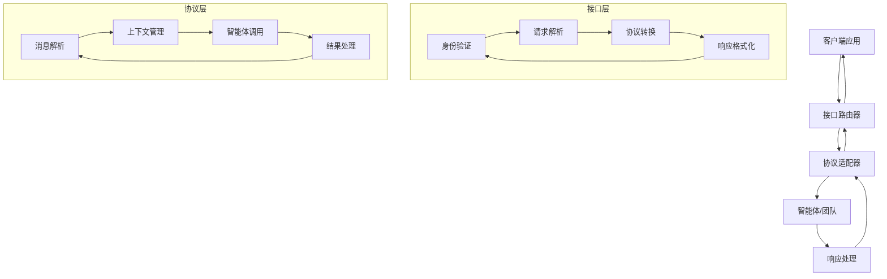

接口使您能够通过各种通信协议和平台暴露 Agno 智能体、团队和工作流。每个接口提供了将 Agno 智能体连接到外部系统、消息平台和前端应用程序的标准化方式。

## 可用接口

<CardGroup cols={2}>
  <Card
    title="AG-UI"
    icon="desktop"
    href="/agent-os/interfaces/ag-ui/introduction"
  >
    使用智能体-用户交互协议将智能体连接到前端应用程序
  </Card>
  <Card
    title="Slack"
    icon="slack"
    href="/agent-os/interfaces/slack/introduction"
  >
    将智能体部署为 Slack 应用程序，用于团队协作
  </Card>
  <Card
    title="WhatsApp"
    icon="whatsapp"
    href="/agent-os/interfaces/whatsapp/introduction"
  >
    通过 WhatsApp 提供智能体服务，实现直接消息交互
  </Card>
  <Card
    title="A2A"
    icon="code"
    href="/agent-os/interfaces/a2a/introduction"
  >
    通过智能体到智能体协议暴露智能体，用于智能体间通信
  </Card>
</CardGroup>

## 接口工作原理

接口是 FastAPI 路由器，在 AgentOS 实例上挂载特定协议的端点。每个接口：

- 将 Agno 智能体、团队或工作流包装成协议兼容的端点
- 处理目标平台的身份验证和请求验证
- 管理会话跟踪和上下文保持
- 以适当的格式将响应流式传输回客户端

## 接口架构

### 核心组件



### 通用特性

所有接口共享以下核心特性：

#### 1. 协议适配

```python
# 协议适配器基类
class ProtocolAdapter:
    def __init__(self, protocol_name):
        self.protocol_name = protocol_name
        self.session_manager = SessionManager()
        self.context_manager = ContextManager()
    
    async def adapt_request(self, request_data):
        """适配请求格式"""
        adapted_request = await self.parse_request(request_data)
        return adapted_request
    
    async def adapt_response(self, response_data, format_type):
        """适配响应格式"""
        if format_type == "json":
            return self.format_json_response(response_data)
        elif format_type == "stream":
            return await self.format_stream_response(response_data)
        elif format_type == "xml":
            return self.format_xml_response(response_data)
        else:
            return self.format_text_response(response_data)
```

#### 2. 身份验证

```python
# 身份验证管理器
class AuthManager:
    def __init__(self, auth_config):
        self.auth_config = auth_config
        self.token_store = TokenStore()
    
    async def authenticate_request(self, request):
        """验证请求身份"""
        auth_header = request.headers.get("Authorization")
        
        if not auth_header:
            raise AuthenticationError("缺少授权头")
        
        token = self.extract_token(auth_header)
        user_info = await self.validate_token(token)
        
        return user_info
    
    async def validate_token(self, token):
        """验证令牌有效性"""
        try:
            payload = jwt.decode(token, self.auth_config.secret_key)
            return self.create_user_info(payload)
        except jwt.InvalidTokenError:
            raise AuthenticationError("无效令牌")
```

#### 3. 会话管理

```python
# 会话管理器
class SessionManager:
    def __init__(self):
        self.active_sessions = {}
        self.session_store = SessionStore()
    
    async def create_session(self, user_id, agent_id):
        """创建新会话"""
        session_id = generate_session_id()
        
        session = Session(
            id=session_id,
            user_id=user_id,
            agent_id=agent_id,
            created_at=datetime.now(),
            status="active"
        )
        
        self.active_sessions[session_id] = session
        await self.session_store.save_session(session)
        
        return session
    
    async def get_session(self, session_id):
        """获取会话信息"""
        if session_id in self.active_sessions:
            return self.active_sessions[session_id]
        
        return await self.session_store.get_session(session_id)
```

## 接口配置

### 全局配置

```python
# 接口全局配置
interface_config = {
    "enabled": True,
    "default_timeout": 30,
    "max_concurrent_requests": 1000,
    "rate_limiting": {
        "enabled": True,
        "requests_per_minute": 100,
        "burst_size": 10
    },
    "cors": {
        "allowed_origins": ["*"],
        "allowed_methods": ["GET", "POST", "PUT", "DELETE"],
        "allowed_headers": ["*"]
    },
    "logging": {
        "level": "INFO",
        "include_request_body": False,
        "include_response_body": True
    }
}
```

### 接口特定配置

```yaml
# AG-UI 配置
ag_ui:
  enabled: true
  endpoint: "/ag-ui"
  allowed_origins: ["http://localhost:3000", "https://app.example.com"]
  session_timeout: "24h"
  max_message_length: 10000
  streaming: true

# Slack 配置
slack:
  enabled: true
  endpoint: "/slack"
  bot_token_env: "SLACK_BOT_TOKEN"
  signing_secret_env: "SLACK_SIGNING_SECRET"
  interactive_components: true
  slash_commands: ["help", "status", "reset"]

# WhatsApp 配置
whatsapp:
  enabled: true
  endpoint: "/whatsapp"
  phone_number_id_env: "WHATSAPP_PHONE_NUMBER_ID"
  access_token_env: "WHATSAPP_ACCESS_TOKEN"
  webhook_verify_token: "verify_token"
  media_handling: true

# A2A 配置
a2a:
  enabled: true
  endpoint: "/a2a"
  authentication_required: True
  agent_discovery: True
  inter_agent_routing: True
  message_routing: "semantic"
```

## 开发自定义接口

### 创建自定义接口

```python
# 自定义接口示例
from agno.interfaces import BaseInterface, InterfaceConfig
from agno.agent import Agent

class CustomInterface(BaseInterface):
    def __init__(self, config: InterfaceConfig):
        super().__init__(config)
        self.custom_handler = CustomHandler()
    
    async def setup_routes(self, app):
        """设置路由"""
        @app.post("/custom/webhook")
        async def handle_webhook(request):
            # 自定义 webhook 处理
            return await self.custom_handler.process_webhook(request)
        
        @app.get("/custom/status")
        async def get_status():
            return {"status": "running", "timestamp": datetime.now()}
    
    async def authenticate_request(self, request):
        """自定义身份验证"""
        # 实现自定义验证逻辑
        api_key = request.headers.get("X-API-Key")
        if api_key != self.config.custom_api_key:
            raise AuthenticationError("无效的 API 密钥")
        return {"user_id": "custom_user", "permissions": ["read", "write"]}
```

### 接口扩展

```python
# 接口扩展示例
class ExtendedSlackInterface(SlackInterface):
    def __init__(self, config):
        super().__init__(config)
        self.custom_commands = CustomSlackCommands()
    
    async def setup_routes(self, app):
        # 添加基础路由
        await super().setup_routes(app)
        
        # 添加自定义路由
        @app.post("/slack/advanced/analyze")
        async def advanced_analyze(request):
            """高级分析功能"""
            return await self.custom_commands.advanced_analyze(request)
        
        @app.get("/slack/reports/generate")
        async def generate_report(request):
            """生成报告"""
            return await self.custom_commands.generate_custom_report(request)
```

## 协议规范

### 请求格式标准

```json
// 标准请求格式
{
  "session_id": "session_123",
  "user_id": "user_456",
  "agent_id": "agent_789",
  "message": "用户消息内容",
  "metadata": {
    "source": "web",
    "timestamp": "2024-01-15T10:30:00Z"
  },
  "tools": ["search", "calculate"],
  "stream": true
}
```

### 响应格式标准

```json
// 标准响应格式
{
  "session_id": "session_123",
  "message_id": "msg_456",
  "content": "智能体响应内容",
  "role": "assistant",
  "timestamp": "2024-01-15T10:30:05Z",
  "metadata": {
    "model": "gpt-4",
    "tokens_used": 150,
    "processing_time": 2.5
  },
  "tools_used": ["search"],
  "next_actions": []
}
```

## 安全考虑

### 认证机制

```python
# 多层认证
class SecurityManager:
    def __init__(self):
        self.auth_providers = {
            "jwt": JWTAuthProvider(),
            "api_key": APIKeyAuthProvider(),
            "oauth": OAuthProvider()
        }
    
    async def authenticate(self, request, auth_type):
        """多层认证"""
        provider = self.auth_providers.get(auth_type)
        if not provider:
            raise AuthenticationError(f"不支持的认证类型: {auth_type}")
        
        return await provider.authenticate(request)
```

### 数据加密

```python
# 数据加密配置
encryption_config = {
    "request_encryption": True,
    "response_encryption": True,
    "session_encryption": True,
    "key_rotation": "weekly",
    "algorithm": "AES-256-GCM"
}
```

### 访问控制

```python
# 访问控制配置
access_control = {
    "rate_limiting": {
        "default": "100 requests/minute",
        "admin": "1000 requests/minute",
        "premium": "10000 requests/minute"
    },
    "ip_whitelist": [
        "192.168.1.0/24",
        "10.0.0.0/8"
    ],
    "blocked_regions": ["CN-1", "KP-1"]
}
```

## 监控和分析

### 接口指标

```python
# 接口监控指标
interface_metrics = {
    "request_count": "请求数量",
    "response_time": "响应时间",
    "error_rate": "错误率",
    "active_sessions": "活跃会话数",
    "token_usage": "令牌使用量",
    "tool_usage": "工具使用统计"
}

async def collect_metrics():
    """收集接口指标"""
    metrics = await metrics_collector.collect_all()
    return metrics
```

### 性能监控

```python
# 性能监控
class PerformanceMonitor:
    def __init__(self):
        self.alert_thresholds = {
            "max_response_time": 5000,  # 5 秒
            "max_error_rate": 0.05,      # 5%
            "min_throughput": 100       # 100 请求/分钟
        }
    
    async def check_performance(self):
        """检查性能指标"""
        metrics = await self.get_current_metrics()
        
        alerts = []
        
        if metrics.avg_response_time > self.alert_thresholds["max_response_time"]:
            alerts.append("响应时间过长")
        
        if metrics.error_rate > self.alert_thresholds["max_error_rate"]:
            alerts.append("错误率过高")
        
        if metrics.throughput < self.alert_thresholds["min_throughput"]:
            alerts.append("吞吐量过低")
        
        if alerts:
            await self.send_performance_alerts(alerts)
```

## 最佳实践

### 1. 接口设计原则

- **一致性**: 所有接口遵循统一的设计模式
- **可扩展性**: 易于添加新功能和协议支持
- **向后兼容**: 保持 API 版本的向后兼容性
- **文档完整**: 提供完整的 API 文档

### 2. 错误处理

- **结构化错误**: 使用标准错误格式
- **详细日志**: 记录详细的错误信息
- **优雅降级**: 在错误时提供备用方案
- **用户友好**: 提供清晰的错误消息

### 3. 性能优化

- **异步处理**: 使用异步操作提高并发性
- **连接池**: 复用数据库连接
- **缓存策略**: 实施智能缓存
- **批量操作**: 支持批量请求处理

### 4. 安全实践

- **最小权限**: 实施最小权限原则
- **定期审计**: 定期审查访问日志
- **加密传输**: 所有敏感数据加密传输
- **监控告警**: 实时监控异常行为

## 故障排除

### 常见问题

#### 连接失败

**问题**: 接口无法连接到 AgentOS
**解决方案**:
1. 检查 AgentOS 连接状态
2. 验证接口配置
3. 检查网络连接
4. 重启代理服务

#### 认证失败

**问题**: 身份验证失败
**解决方案**:
1. 检查令牌有效性
2. 验证密钥配置
3. 确认权限设置
4. 刷新访问令牌

#### 响应超时

**问题**: 请求响应超时
**解决方案**:
1. 增加超时时间设置
2. 检查网络延迟
3. 优化处理逻辑
4. 实施重试机制

### 调试工具

```python
# 接口调试工具
async def debug_interface(interface_name):
    """调试接口状态"""
    interface = get_interface(interface_name)
    
    # 检查接口状态
    status = await interface.get_status()
    print(f"接口状态: {status}")
    
    # 测试连接
    test_result = await interface.test_connection()
    print(f"连接测试: {test_result}")
    
    # 检查配置
    config = interface.get_config()
    print(f"接口配置: {config}")

asyncio.run(debug_interface("slack"))
```

## 下一步

- 查看[AG-UI 接口](/agent-os/interfaces/ag-ui/introduction)
- 了解[Slack 接口](/agent-os/interfaces/slack/introduction)
- 探索[WhatsApp 接口](/agent-os/interfaces/whatsapp/introduction)
- 查看[A2A 接口](/agent-os/interfaces/a2a/introduction)