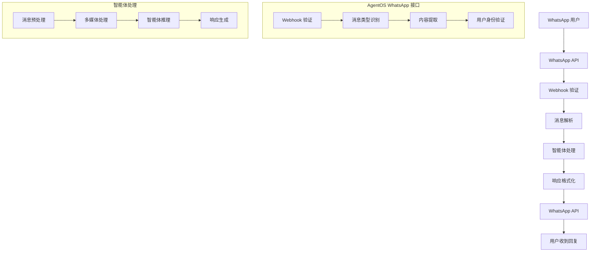

使用 WhatsApp 接口通过 WhatsApp 提供智能体或团队服务。它在 FastAPI 应用上挂载 webhook 路由，并将响应发送回 WhatsApp 用户和线程。

## 设置

请按照 [WhatsApp Cookbook](https://github.com/agno-agi/agno/blob/main/cookbook/06_agent_os/interfaces/whatsapp/readme.md) 中的 WhatsApp 设置指南进行操作。

必需的环境变量：

- `WHATSAPP_ACCESS_TOKEN`
- `WHATSAPP_PHONE_NUMBER_ID`
- `WHATSAPP_VERIFY_TOKEN`
- 可选（生产环境）：`WHATSAPP_APP_SECRET` 和 `APP_ENV=production`

<Note>
用户的电话号码会自动用作运行的 `user_id`。这确保会话和内存适当地限定给用户。

电话号码也用于 `session_id`，因此单个 WhatsApp 对话对应单个会话。在管理会话历史时应考虑这一点。
</Note>

## 示例用法

创建一个智能体，使用 `Whatsapp` 接口暴露它，并通过 `AgentOS` 提供服务：

```python
from agno.agent import Agent
from agno.models.openai import OpenAIChat
from agno.os import AgentOS
from agno.os.interfaces.whatsapp import Whatsapp
from agno.tools.openai import OpenAITools

# 创建图像处理智能体
image_agent = Agent(
    name="图像助手",
    model=OpenAIChat(id="gpt-5-mini"), # 确保设置了 OPENAI_API_KEY
    tools=[OpenAITools(image_model="gpt-image-1")],
    markdown=True,
    add_history_to_context=True,
    instructions="""
    你是一个专业的 WhatsApp 图像处理助手。
    可以帮助用户分析图像、生成图像描述、提供图像相关的建议。
    请用简洁、友好的中文回答用户问题。
    支持多种图像格式，包括 JPG、PNG、GIF 等。
    """
)

# 创建带有 WhatsApp 接口的 AgentOS 实例
agent_os = AgentOS(
    agents=[image_agent],
    interfaces=[Whatsapp(agent=image_agent)],
)
app = agent_os.get_app()

# 启动服务
if __name__ == "__main__":
    agent_os.serve(app="basic:app", port=8000, reload=True)
```

## WhatsApp 接口架构

### 消息处理流程



## 高级配置

### 1. 自定义 WhatsApp 配置

```python
from agno.os.interfaces.whatsapp import Whatsapp, WhatsappConfig

# 自定义 WhatsApp 配置
whatsapp_config = WhatsappConfig(
    endpoint="/whatsapp/webhook",
    access_token_env="WHATSAPP_ACCESS_TOKEN",
    phone_number_id_env="WHATSAPP_PHONE_NUMBER_ID",
    verify_token_env="WHATSAPP_VERIFY_TOKEN",
    app_secret_env="WHATSAPP_APP_SECRET",
    app_env="production",
    webhook_verify_token="your_verify_token",
    media_handling=True,
    max_file_size=10485760,  # 10MB
    supported_mime_types=[
        "image/jpeg", "image/png", "image/gif", "image/webp",
        "audio/mpeg", "audio/wav", "audio/ogg",
        "video/mp4", "video/webm",
        "text/plain", "application/pdf"
    ],
    interactive_messages=True,
    template_messages=True,
    location_messages=True,
    contact_messages=True
)

# 创建自定义 WhatsApp 接口
whatsapp_interface = Whatsapp(
    agent=image_agent,
    config=whatsapp_config
)
```

### 2. 多智能体 WhatsApp 集成

```python
from agno.agent import Agent
from agno.team import Team
from agno.os.interfaces.whatsapp import Whatsapp

# 创建专门的智能体
customer_service_agent = Agent(
    name="客服助手",
    instructions="你是专业的客服代表，处理客户咨询和问题解决"
)

medical_agent = Agent(
    name="医疗助手", 
    instructions="你是医疗健康专家，提供健康建议和医疗信息"
)

education_agent = Agent(
    name="教育助手",
    instructions="你是教育专家，提供学习建议和知识解答"
)

# 创建智能体团队
service_team = Team(
    agents=[customer_service_agent, medical_agent, education_agent],
    instructions="团队协作为用户提供全面的服务支持"
)

# 智能路由器
class WhatsAppRouter:
    def __init__(self):
        self.agents = {
            "customer_service": customer_service_agent,
            "medical": medical_agent,
            "education": education_agent,
            "general": service_team
        }
    
    async def route_message(self, message, user_id):
        """根据消息内容路由到合适的智能体"""
        content = message.get("text", "").lower()
        
        if any(keyword in content for keyword in ["客服", "服务", "投诉", "问题"]):
            return self.agents["customer_service"]
        elif any(keyword in content for keyword in ["医疗", "健康", "病症", "医生"]):
            return self.agents["medical"]
        elif any(keyword in content for keyword in ["学习", "教育", "知识", "问题"]):
            return self.agents["education"]
        else:
            return self.agents["general"]

# 应用智能路由
router = WhatsAppRouter()

class SmartWhatsappInterface(Whatsapp):
    async def process_message(self, message_data):
        """智能处理消息"""
        user_id = message_data.get("from")
        message = message_data.get("message", {})
        
        # 路由到合适的智能体
        target_agent = await router.route_message(message, user_id)
        
        # 处理消息
        response = await target_agent.run(
            message.get("text", ""),
            user_id=user_id,
            session_id=user_id  # 使用用户ID作为会话ID
        )
        
        return response

# 创建智能 WhatsApp 接口
whatsapp_interface = SmartWhatsappInterface(agent=service_team)
```

### 3. 自定义消息处理器

```python
from agno.os.interfaces.whatsapp import MessageHandler

class CustomWhatsAppHandler(MessageHandler):
    async def handle_text_message(self, message_data):
        """处理文本消息"""
        text = message_data.get("text", {}).get("body", "")
        user_id = message_data.get("from")
        
        # 检查是否是特殊命令
        if text.startswith("/"):
            await self.handle_command(message_data)
        else:
            await super().handle_text_message(message_data)
    
    async def handle_command(self, message_data):
        """处理命令消息"""
        command = message_data.get("text", {}).get("body", "").lower()
        user_id = message_data.get("from")
        
        if command == "/help":
            await self.send_help_menu(user_id)
        elif command == "/status":
            await self.send_service_status(user_id)
        elif command == "/menu":
            await self.send_interactive_menu(user_id)
        elif command == "/location":
            await self.request_location(user_id)
    
    async def send_help_menu(self, user_id):
        """发送帮助菜单"""
        help_text = """
        🤖 *智能助手功能菜单*
        
        📝 *文本服务*:
        • 直接发送消息开始对话
        • 发送"/help"查看此菜单
        
        🖼️ *图像服务*:
        • 发送图片进行图像分析
        • 支持JPG、PNG、GIF格式
        
        📍 *位置服务*:
        • 发送"/location"分享位置
        • 获取基于位置的推荐
        
        📞 *其他功能*:
        • 发送"/status"查看服务状态
        • 发送"/menu"查看交互菜单
        
        💡 *提示*: 我可以处理多种消息类型，包括文本、图片、音频和视频！
        """
        
        await self.send_text_message(user_id, help_text)
    
    async def send_interactive_menu(self, user_id):
        """发送交互式菜单"""
        interactive_message = {
            "type": "interactive",
            "interactive": {
                "type": "button",
                "body": {
                    "text": "🎯 请选择您需要的服务："
                },
                "action": {
                    "buttons": [
                        {
                            "type": "reply",
                            "reply": {
                                "id": "customer_service",
                                "title": "🛎️ 客服支持"
                            }
                        },
                        {
                            "type": "reply",
                            "reply": {
                                "id": "image_analysis",
                                "title": "🖼️ 图像分析"
                            }
                        },
                        {
                            "type": "reply",
                            "reply": {
                                "id": "general_assist",
                                "title": "💬 一般咨询"
                            }
                        }
                    ]
                }
            }
        }
        
        await self.send_interactive_message(user_id, interactive_message)
    
    async def request_location(self, user_id):
        """请求用户位置"""
        location_request = {
            "type": "interactive",
            "interactive": {
                "type": "location_request_message",
                "body": {
                    "text": "📍 请分享您的位置，我将为您提供基于位置的个性化服务。"
                },
                "action": {
                    "name": "send_location"
                }
            }
        }
        
        await self.send_interactive_message(user_id, location_request)

# 应用自定义消息处理器
whatsapp_interface = Whatsapp(
    agent=image_agent,
    message_handler=CustomWhatsAppHandler()
)
```

## 多媒体处理

### 1. 图像处理

```python
from agno.os.interfaces.whatsapp import MediaHandler
import base64
import io
from PIL import Image

class WhatsAppImageHandler(MediaHandler):
    async def handle_image_message(self, message_data):
        """处理图像消息"""
        media_id = message_data.get("message", {}).get("image", {}).get("id")
        user_id = message_data.get("from")
        
        # 下载图像
        image_data = await self.download_media(media_id)
        
        # 分析图像
        analysis = await self.analyze_image(image_data, user_id)
        
        # 发送分析结果
        await self.send_text_message(user_id, analysis)
    
    async def analyze_image(self, image_data, user_id):
        """分析图像内容"""
        try:
            # 将图像转换为适合的格式
            image = Image.open(io.BytesIO(image_data))
            
            # 生成图像描述
            analysis_prompt = """
            请详细描述这张图片的内容，包括：
            1. 图片中的主要对象和场景
            2. 颜色、风格和构图特点
            3. 可能的用途或意义
            4. 如果有人物，描述人物状态
            
            请用简洁、准确的中文回答。
            """
            
            # 使用多模态智能体分析图像
            response = await self.agent.run(
                analysis_prompt,
                images=[image_data],
                user_id=user_id
            )
            
            return f"🖼️ *图像分析结果*\n\n{response.content}"
            
        except Exception as e:
            return f"❌ 图像处理失败：{str(e)}"
    
    async def process_image_with_ocr(self, image_data, user_id):
        """使用 OCR 处理图像中的文字"""
        ocr_prompt = """
        请识别并提取图片中的所有文字内容。
        如果有表格，请保持表格格式。
        如果有多个文本区域，请分别列出。
        
        请用中文回复提取的文字内容。
        """
        
        response = await self.agent.run(
            ocr_prompt,
            images=[image_data],
            user_id=user_id
        )
        
        return f"📝 *图片文字识别*\n\n{response.content}"

# 应用图像处理器
image_handler = WhatsAppImageHandler()
whatsapp_interface = Whatsapp(
    agent=image_agent,
    media_handler=image_handler
)
```

## 最佳实践

### 1. 性能优化

- **异步处理**: 使用异步操作处理 WhatsApp webhook
- **媒体缓存**: 缓存下载的媒体文件
- **连接池**: 复用 HTTP 客户端连接
- **批量操作**: 批量处理消息发送

### 2. 用户体验

- **快速响应**: 在24小时内回复所有消息
- **个性化**: 记住用户偏好和对话历史
- **多媒体支持**: 支持各种消息类型
- **智能路由**: 根据内容类型智能分配处理

### 3. 合规性

- **消息模板**: 使用经过批准的消息模板
- **用户同意**: 确保获得适当的用户同意
- **数据保护**: 保护用户隐私和数据安全
- **24小时规则**: 遵守WhatsApp的24小时消息发送规则

## 故障排除

### 常见问题

#### Webhook 验证失败

**问题**: WhatsApp webhook 验证失败
**解决方案**:
1. 检查 `WHATSAPP_VERIFY_TOKEN` 配置
2. 确认 webhook URL 可访问
3. 验证验证逻辑正确

#### 消息发送失败

**问题**: 消息无法发送给用户
**解决方案**:
1. 检查用户是否主动发送过消息
2. 验证是否在24小时时间窗口内
3. 确认消息模板是否经过批准

## 下一步

- 查看[A2A 接口](/agent-os/interfaces/a2a/introduction)
- 了解[AG-UI 接口](/agent-os/interfaces/ag-ui/introduction)
- 探索[Slack 接口](/agent-os/interfaces/slack/introduction)
- 查看[AgentOS 配置](/agent-os/config)