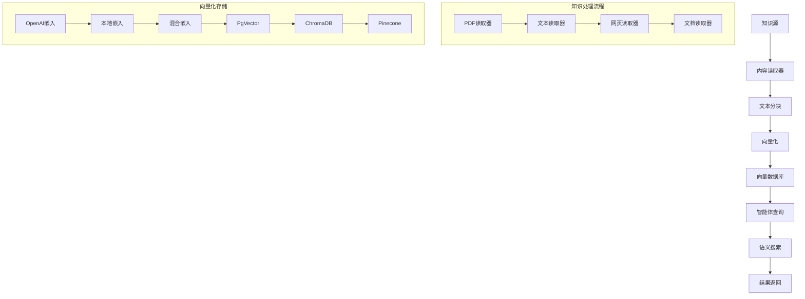

AgentOS 控制平面提供了一种简单的方式来[管理](/agent-os/features/knowledge-management#adding-content)您的知识库。
您可以通过控制平面直接在知识库中添加、编辑和删除内容。

您可以指定多个知识库，并根据需要在不同智能体或团队中重用相同的知识实例。

## 前置条件

在 AgentOS 中设置知识管理之前，请确保您具备：

- 运行且可访问的 PostgreSQL 数据库 - 本示例使用
- 已安装必需依赖：`pip install agno`
- 已配置 OpenAI API 密钥（用于嵌入）
- 对[知识概念](/basics/knowledge/getting-started)的基本了解

## 示例

此示例演示如何将多个知识库附加到 AgentOS，
并使用来自不同源的内容填充它们。

```python agentos_knowledge.py
from textwrap import dedent

from agno.db.postgres import PostgresDb
from agno.knowledge.embedder.openai import OpenAIEmbedder
from agno.knowledge.knowledge import Knowledge
from agno.os import AgentOS
from agno.vectordb.pgvector import PgVector, SearchType

# ************* 设置知识数据库 *************
db_url = "postgresql+psycopg://ai:ai@localhost:5532/ai"

# 文档数据库
documents_db = PostgresDb(
    db_url,
    id="agno_knowledge_db",
    knowledge_table="agno_knowledge_contents",
)

# FAQ 数据库
faq_db = PostgresDb(
    db_url,
    id="agno_faq_db",
    knowledge_table="agno_faq_contents",
)
# *******************************

# 文档知识库
documents_knowledge = Knowledge(
    vector_db=PgVector(
        db_url=documents_db.db_url,
        table_name="agno_documents",
        embedder=OpenAIEmbedder(),
        search_type=SearchType.hybrid,
    ),
    reader=PdfReader(),
    num_chunks=10,
)

# FAQ 知识库
faq_knowledge = Knowledge(
    vector_db=PgVector(
        db_url=faq_db.db_url,
        table_name="agno_faqs", 
        embedder=OpenAIEmbedder(),
        search_type=SearchType.hybrid,
    ),
    reader=TextReader(),
    num_chunks=5,
)

# ************* 创建带知识库的 AgentOS *************
agent_os = AgentOS(
    knowledge=[documents_knowledge, faq_knowledge],
)

# 启动控制平面
if __name__ == "__main__":
    agent_os.serve()
# *******************************
```

## 知识管理架构

### 核心组件



## 高级配置

### 1. 多知识库管理

```python
from agno.knowledge.knowledge import Knowledge
from agno.vectordb.pgvector import PgVector
from agno.knowledge.embedder.openai import OpenAIEmbedder
from agno.reader.pdf import PdfReader
from agno.reader.text import TextReader
from agno.reader.website import WebsiteReader

# 创建专门的知识库
product_docs = Knowledge(
    vector_db=PgVector(
        db_url=db_url,
        table_name="product_docs",
        embedder=OpenAIEmbedder(model="text-embedding-3-large"),
        search_type=SearchType.hybrid,
    ),
    reader=PdfReader(),
    num_chunks=15,
    chunk_size=1000,
    chunk_overlap=200,
)

technical_docs = Knowledge(
    vector_db=PgVector(
        db_url=db_url,
        table_name="technical_docs", 
        embedder=OpenAIEmbedder(model="text-embedding-3-large"),
        search_type=SearchType.semantic,
    ),
    reader=WebsiteReader(),
    num_chunks=20,
    chunk_size=1500,
    chunk_overlap=300,
)

user_manuals = Knowledge(
    vector_db=PgVector(
        db_url=db_url,
        table_name="user_manuals",
        embedder=OpenAIEmbedder(model="text-embedding-3-large"),
        search_type=SearchType.keyword,
    ),
    reader=TextReader(),
    num_chunks=10,
    chunk_size=800,
    chunk_overlap=150,
)

# 创建带多个知识库的 AgentOS
agent_os = AgentOS(
    knowledge=[product_docs, technical_docs, user_manuals],
    knowledge_config={
        "default_knowledge": "product_docs",
        "enable_fallback": True,
        "ranking_strategy": "reciprocal_rank_fusion",
        "max_results_per_knowledge": 5,
        "similarity_threshold": 0.7
    }
)
```

### 2. 自定义读取器配置

```python
from agno.reader.pdf import PdfReader
from agno.reader.website import WebsiteReader
from agno.reader.json import JsonReader

# 自定义 PDF 读取器
custom_pdf_reader = PdfReader(
    chunk_size=1200,
    chunk_overlap=200,
    extract_images=True,
    extract_tables=True,
    ocr_enabled=True,
    language="zh-CN"
)

# 自定义网页读取器
custom_web_reader = WebsiteReader(
    chunk_size=1000,
    chunk_overlap=150,
    exclude_selectors=["nav", "footer", "sidebar"],
    include_selectors=["main", "article", ".content"],
    wait_for_selector=2.0,
    javascript_enabled=True
)

# 自定义 JSON 读取器
custom_json_reader = JsonReader(
    chunk_size=800,
    chunk_overlap=100,
    json_paths=["$.content", "$.description", "$.text"],
    flatten_nested=True,
    preserve_structure=True
)

# 应用自定义读取器
knowledge = Knowledge(
    vector_db=PgVector(db_url=db_url, table_name="custom_docs"),
    reader=custom_pdf_reader,
    num_chunks=25,
)
```

### 3. 高级向量化配置

```python
from agno.knowledge.embedder.openai import OpenAIEmbedder
from agno.knowledge.embedder.huggingface import HuggingFaceEmbedder
from agno.knowledge.embedder.cohere import CohereEmbedder

# OpenAI 嵌入器配置
openai_embedder = OpenAIEmbedder(
    model="text-embedding-3-large",
    dimensions=3072,
    batch_size=100,
    max_retries=3,
    timeout=30
)

# HuggingFace 嵌入器配置
hf_embedder = HuggingFaceEmbedder(
    model="BAAI/bge-large-zh-v1.5",
    model_kwargs={"device": "cuda"},
    encode_kwargs={"normalize_embeddings": True}
)

# Cohere 嵌入器配置
cohere_embedder = CohereEmbedder(
    model="embed-multilingual-v3.0",
    input_type="search_document"
)

# 多语言嵌入器
multilingual_embedder = OpenAIEmbedder(
    model="text-embedding-3-large",
    dimensions=3072,
    supported_languages=["zh", "en", "ja", "ko", "es", "fr", "de"]
)

# 创建带自定义嵌入器的知识库
knowledge = Knowledge(
    vector_db=PgVector(db_url=db_url, table_name="multilingual_docs"),
    embedder=multilingual_embedder,
    reader=custom_pdf_reader,
    num_chunks=20,
)
```

## 知识库操作

### 1. 添加内容到知识库

```python
import asyncio
from agno.knowledge.knowledge import Knowledge

class KnowledgeManager:
    def __init__(self, knowledge_instance):
        self.knowledge = knowledge_instance
    
    async def add_documents_from_directory(self, directory_path):
        """从目录添加文档"""
        import os
        from pathlib import Path
        
        supported_extensions = [".pdf", ".txt", ".md", ".docx", ".html"]
        documents_added = 0
        
        for file_path in Path(directory_path).rglob("*"):
            if file_path.suffix.lower() in supported_extensions:
                try:
                    await self.knowledge.add_content(str(file_path))
                    documents_added += 1
                    print(f"已添加文档: {file_path}")
                except Exception as e:
                    print(f"添加文档失败 {file_path}: {e}")
        
        return documents_added
    
    async def add_website_content(self, urls):
        """添加网站内容"""
        for url in urls:
            try:
                await self.knowledge.add_content(url)
                print(f"已添加网站内容: {url}")
            except Exception as e:
                print(f"添加网站内容失败 {url}: {e}")
    
    async def add_text_content(self, texts, metadata=None):
        """添加文本内容"""
        for i, text in enumerate(texts):
            try:
                content_metadata = metadata or {"source": f"manual_input_{i}"}
                await self.knowledge.add_content(text, metadata=content_metadata)
                print(f"已添加文本内容 {i+1}/{len(texts)}")
            except Exception as e:
                print(f"添加文本内容失败 {i+1}: {e}")
    
    async def bulk_add_content(self, content_list):
        """批量添加内容"""
        batch_size = 10
        for i in range(0, len(content_list), batch_size):
            batch = content_list[i:i + batch_size]
            tasks = []
            
            for content in batch:
                if isinstance(content, str):
                    task = self.knowledge.add_content(content)
                else:
                    task = self.knowledge.add_content(
                        content["text"], 
                        metadata=content.get("metadata", {})
                    )
                tasks.append(task)
            
            try:
                await asyncio.gather(*tasks)
                print(f"已完成批次 {i//batch_size + 1}/{(len(content_list)-1)//batch_size + 1}")
            except Exception as e:
                print(f"批次处理失败: {e}")

# 使用知识管理器
manager = KnowledgeManager(documents_knowledge)

# 添加不同类型的内容
await manager.add_documents_from_directory("./documents")
await manager.add_website_content([
    "https://example.com/docs",
    "https://example.com/faq"
])
await manager.add_text_content([
    "这是重要的产品信息...",
    "用户常见问题解答...",
    "技术规格说明..."
])
```

### 2. 知识库查询和搜索

```python
from agno.knowledge.knowledge import Knowledge

class KnowledgeSearcher:
    def __init__(self, knowledge_instances):
        self.knowledge_instances = knowledge_instances
    
    async def search_all_knowledge(self, query, max_results=10):
        """在所有知识库中搜索"""
        all_results = []
        
        for knowledge_name, knowledge in self.knowledge_instances.items():
            try:
                results = await knowledge.search(query, limit=max_results)
                
                for result in results:
                    result["knowledge_source"] = knowledge_name
                    all_results.append(result)
                    
            except Exception as e:
                print(f"搜索知识库 {knowledge_name} 失败: {e}")
        
        # 按相关性排序
        all_results.sort(key=lambda x: x.get("score", 0), reverse=True)
        
        return all_results[:max_results]
    
    async def semantic_search(self, query, knowledge_name=None):
        """语义搜索"""
        if knowledge_name and knowledge_name in self.knowledge_instances:
            knowledge = self.knowledge_instances[knowledge_name]
            return await knowledge.search(query, search_type="semantic")
        else:
            return await self.search_all_knowledge(query)
    
    async def keyword_search(self, query, knowledge_name=None):
        """关键词搜索"""
        if knowledge_name and knowledge_name in self.knowledge_instances:
            knowledge = self.knowledge_instances[knowledge_name]
            return await knowledge.search(query, search_type="keyword")
        else:
            results = []
            for knowledge in self.knowledge_instances.values():
                try:
                    keyword_results = await knowledge.search(
                        query, search_type="keyword"
                    )
                    results.extend(keyword_results)
                except Exception as e:
                    print(f"关键词搜索失败: {e}")
            return results
    
    async def hybrid_search(self, query, weights=None):
        """混合搜索"""
        if weights is None:
            weights = {"semantic": 0.7, "keyword": 0.3}
        
        all_results = []
        
        for knowledge_name, knowledge in self.knowledge_instances.items():
            try:
                semantic_results = await knowledge.search(
                    query, search_type="semantic"
                )
                keyword_results = await knowledge.search(
                    query, search_type="keyword"
                )
                
                # 合并和重新评分
                combined_results = self.combine_search_results(
                    semantic_results, keyword_results, weights
                )
                
                for result in combined_results:
                    result["knowledge_source"] = knowledge_name
                    all_results.append(result)
                    
            except Exception as e:
                print(f"混合搜索失败 {knowledge_name}: {e}")
        
        return sorted(all_results, key=lambda x: x.get("combined_score", 0), reverse=True)
    
    def combine_search_results(self, semantic_results, keyword_results, weights):
        """合并搜索结果"""
        combined = {}
        
        # 处理语义搜索结果
        for result in semantic_results:
            doc_id = result.get("id", str(hash(result.get("content", ""))))
            combined[doc_id] = {
                **result,
                "semantic_score": result.get("score", 0),
                "keyword_score": 0,
                "combined_score": result.get("score", 0) * weights["semantic"]
            }
        
        # 处理关键词搜索结果
        for result in keyword_results:
            doc_id = result.get("id", str(hash(result.get("content", ""))))
            if doc_id in combined:
                combined[doc_id]["keyword_score"] = result.get("score", 0)
                combined[doc_id]["combined_score"] += result.get("score", 0) * weights["keyword"]
            else:
                combined[doc_id] = {
                    **result,
                    "semantic_score": 0,
                    "keyword_score": result.get("score", 0),
                    "combined_score": result.get("score", 0) * weights["keyword"]
                }
        
        return list(combined.values())

# 使用知识搜索器
searcher = KnowledgeSearcher({
    "documents": documents_knowledge,
    "faq": faq_knowledge,
    "technical": technical_docs
})

# 执行不同类型的搜索
semantic_results = await searcher.semantic_search("如何安装产品？")
keyword_results = await searcher.keyword_search("安装指南")
hybrid_results = await searcher.hybrid_search("产品安装步骤")
```

### 3. 知识库维护和更新

```python
from agno.knowledge.knowledge import Knowledge
import datetime

class KnowledgeMaintenance:
    def __init__(self, knowledge_instances):
        self.knowledge_instances = knowledge_instances
    
    async def update_knowledge_content(self, knowledge_name, content_id, new_content):
        """更新知识库内容"""
        if knowledge_name not in self.knowledge_instances:
            raise ValueError(f"知识库 {knowledge_name} 不存在")
        
        knowledge = self.knowledge_instances[knowledge_name]
        
        try:
            # 删除旧内容
            await knowledge.delete_content(content_id)
            
            # 添加新内容
            await knowledge.add_content(new_content, metadata={"updated_at": datetime.datetime.now()})
            
            print(f"已更新知识库 {knowledge_name} 中的内容 {content_id}")
            
        except Exception as e:
            print(f"更新内容失败: {e}")
            raise
    
    async def delete_outdated_content(self, knowledge_name, days_old=30):
        """删除过时内容"""
        if knowledge_name not in self.knowledge_instances:
            raise ValueError(f"知识库 {knowledge_name} 不存在")
        
        knowledge = self.knowledge_instances[knowledge_name]
        cutoff_date = datetime.datetime.now() - datetime.timedelta(days=days_old)
        
        try:
            # 获取过时内容
            outdated_content = await knowledge.get_content_by_date(cutoff_date)
            
            # 删除过时内容
            for content_id in outdated_content:
                await knowledge.delete_content(content_id)
            
            print(f"已删除 {len(outdated_content)} 条过时内容")
            
        except Exception as e:
            print(f"删除过时内容失败: {e}")
            raise
    
    async def rebuild_knowledge_index(self, knowledge_name):
        """重建知识库索引"""
        if knowledge_name not in self.knowledge_instances:
            raise ValueError(f"知识库 {knowledge_name} 不存在")
        
        knowledge = self.knowledge_instances[knowledge_name]
        
        try:
            # 获取所有内容
            all_content = await knowledge.get_all_content()
            
            # 清空向量数据库
            await knowledge.clear_vector_db()
            
            # 重新添加内容
            for content in all_content:
                await knowledge.add_content(
                    content["text"],
                    metadata=content.get("metadata", {})
                )
            
            print(f"已重建知识库 {knowledge_name} 的索引")
            
        except Exception as e:
            print(f"重建索引失败: {e}")
            raise
    
    async def optimize_knowledge_storage(self, knowledge_name):
        """优化知识库存储"""
        if knowledge_name not in self.knowledge_instances:
            raise ValueError(f"知识库 {knowledge_name} 不存在")
        
        knowledge = self.knowledge_instances[knowledge_name]
        
        try:
            # 分析存储使用情况
            storage_stats = await knowledge.get_storage_stats()
            
            # 压缩重复内容
            duplicates = await knowledge.find_duplicate_content()
            for duplicate_group in duplicates:
                # 保留最新的版本，删除其他版本
                latest = max(duplicate_group, key=lambda x: x.get("created_at", ""))
                for item in duplicate_group:
                    if item != latest:
                        await knowledge.delete_content(item["id"])
            
            # 优化向量索引
            await knowledge.optimize_vector_index()
            
            print(f"已优化知识库 {knowledge_name} 的存储")
            
        except Exception as e:
            print(f"优化存储失败: {e}")
            raise
    
    async def backup_knowledge(self, knowledge_name, backup_path):
        """备份知识库"""
        if knowledge_name not in self.knowledge_instances:
            raise ValueError(f"知识库 {knowledge_name} 不存在")
        
        knowledge = self.knowledge_instances[knowledge_name]
        
        try:
            # 导出所有内容
            all_content = await knowledge.export_content()
            
            # 保存到文件
            import json
            with open(backup_path, "w", encoding="utf-8") as f:
                json.dump(all_content, f, ensure_ascii=False, indent=2)
            
            print(f"已备份知识库 {knowledge_name} 到 {backup_path}")
            
        except Exception as e:
            print(f"备份失败: {e}")
            raise
    
    async def restore_knowledge(self, knowledge_name, backup_path):
        """恢复知识库"""
        if knowledge_name not in self.knowledge_instances:
            raise ValueError(f"知识库 {knowledge_name} 不存在")
        
        knowledge = self.knowledge_instances[knowledge_name]
        
        try:
            # 从文件加载内容
            import json
            with open(backup_path, "r", encoding="utf-8") as f:
                all_content = json.load(f)
            
            # 清空现有内容
            await knowledge.clear_vector_db()
            
            # 恢复内容
            for content in all_content:
                await knowledge.add_content(
                    content["text"],
                    metadata=content.get("metadata", {})
                )
            
            print(f"已从 {backup_path} 恢复知识库 {knowledge_name}")
            
        except Exception as e:
            print(f"恢复失败: {e}")
            raise

# 使用知识维护工具
maintenance = KnowledgeMaintenance({
    "documents": documents_knowledge,
    "faq": faq_knowledge
})

# 执行维护操作
await maintenance.update_knowledge_content("documents", "doc_123", "新的文档内容...")
await maintenance.delete_outdated_content("faq", days_old=90)
await maintenance.rebuild_knowledge_index("documents")
await maintenance.backup_knowledge("documents", "backup_20241230.json")
```

## 监控和分析

### 1. 知识库使用统计

```python
from agno.knowledge.knowledge import Knowledge
import time
from collections import defaultdict

class KnowledgeAnalytics:
    def __init__(self, knowledge_instances):
        self.knowledge_instances = knowledge_instances
        self.usage_stats = defaultdict(lambda: {
            "search_count": 0,
            "total_response_time": 0,
            "error_count": 0,
            "popular_queries": defaultdict(int),
            "content_access": defaultdict(int)
        })
    
    async def track_search(self, knowledge_name, query, response_time, results_count, success=True):
        """跟踪搜索统计"""
        stats = self.usage_stats[knowledge_name]
        
        stats["search_count"] += 1
        stats["total_response_time"] += response_time
        stats["popular_queries"][query.lower()] += 1
        
        if not success:
            stats["error_count"] += 1
        
        # 记录内容访问
        for result in results[:5]:  # 只记录前5个结果
            content_id = result.get("id", "")
            if content_id:
                stats["content_access"][content_id] += 1
    
    def generate_usage_report(self, knowledge_name=None):
        """生成使用报告"""
        if knowledge_name:
            return self._generate_single_report(knowledge_name)
        else:
            return {name: self._generate_single_report(name) 
                   for name in self.knowledge_instances.keys()}
    
    def _generate_single_report(self, knowledge_name):
        """生成单个知识库的报告"""
        stats = self.usage_stats[knowledge_name]
        
        avg_response_time = (
            stats["total_response_time"] / stats["search_count"]
            if stats["search_count"] > 0 else 0
        )
        
        error_rate = (
            stats["error_count"] / stats["search_count"]
            if stats["search_count"] > 0 else 0
        )
        
        popular_queries = sorted(
            stats["popular_queries"].items(),
            key=lambda x: x[1],
            reverse=True
        )[:10]
        
        popular_content = sorted(
            stats["content_access"].items(),
            key=lambda x: x[1],
            reverse=True
        )[:10]
        
        return {
            "knowledge_name": knowledge_name,
            "period": "last_30_days",
            "summary": {
                "total_searches": stats["search_count"],
                "avg_response_time": f"{avg_response_time:.3f}s",
                "error_rate": f"{error_rate:.2%}",
                "unique_queries": len(stats["popular_queries"])
            },
            "popular_queries": [
                {"query": query, "count": count}
                for query, count in popular_queries
            ],
            "popular_content": [
                {"content_id": content_id, "access_count": count}
                for content_id, count in popular_content
            ]
        }
    
    async def analyze_search_patterns(self, knowledge_name):
        """分析搜索模式"""
        stats = self.usage_stats[knowledge_name]
        
        # 分析查询长度分布
        query_lengths = []
        for query in stats["popular_queries"].keys():
            query_lengths.append(len(query.split()))
        
        avg_query_length = sum(query_lengths) / len(query_lengths) if query_lengths else 0
        
        # 分析搜索时间分布
        hourly_searches = defaultdict(int)
        # 这里需要添加时间戳记录逻辑
        
        return {
            "avg_query_length": avg_query_length,
            "query_length_distribution": self._get_length_distribution(query_lengths),
            "search_frequency": "high" if stats["search_count"] > 1000 else "medium" if stats["search_count"] > 100 else "low"
        }
    
    def _get_length_distribution(self, lengths):
        """获取长度分布"""
        distribution = {"short": 0, "medium": 0, "long": 0}
        
        for length in lengths:
            if length <= 3:
                distribution["short"] += 1
            elif length <= 7:
                distribution["medium"] += 1
            else:
                distribution["long"] += 1
        
        total = sum(distribution.values())
        if total > 0:
            for key in distribution:
                distribution[key] = distribution[key] / total
        
        return distribution

# 使用知识分析工具
analytics = KnowledgeAnalytics({
    "documents": documents_knowledge,
    "faq": faq_knowledge
})

# 模拟搜索跟踪
await analytics.track_search(
    "documents", "如何安装产品", 1.2, 5, success=True
)
await analytics.track_search(
    "faq", "常见问题", 0.8, 3, success=True
)

# 生成报告
report = analytics.generate_usage_report()
print(f"知识库使用报告: {report}")
```

## 最佳实践

### 1. 知识库设计原则

- **内容分类**: 按主题和用途合理分类知识库
- **更新策略**: 定期更新和清理过时内容
- **质量保证**: 确保内容的准确性和相关性
- **访问控制**: 实施适当的权限管理

### 2. 性能优化

- **分块策略**: 根据内容类型优化分块大小
- **索引优化**: 定期重建和优化向量索引
- **缓存机制**: 实施智能缓存提高查询速度
- **批量处理**: 使用批量操作提高效率

### 3. 内容管理

- **版本控制**: 跟踪内容变更历史
- **元数据管理**: 丰富内容元数据信息
- **重复检测**: 识别和处理重复内容
- **质量评估**: 定期评估内容质量

## 故障排除

### 常见问题

#### 向量化失败

**问题**: 内容向量化失败
**解决方案**:
1. 检查嵌入器配置和API密钥
2. 验证内容格式和编码
3. 调整分块大小和重叠
4. 检查网络连接

#### 搜索结果不准确

**问题**: 搜索结果相关性低
**解决方案**:
1. 调整相似度阈值
2. 优化分块策略
3. 使用混合搜索
4. 改进内容预处理

#### 性能问题

**问题**: 查询响应时间过长
**解决方案**:
1. 优化向量数据库配置
2. 实施查询缓存
3. 调整批处理大小
4. 考虑数据库索引优化

## 下一步

- 查看[过滤知识](/agent-os/knowledge/filter-knowledge)
- 了解[知识管理功能](/agent-os/features/knowledge-management)
- 探索[AgentOS 配置](/agent-os/config)
- 查看[向量数据库选项](/basics/knowledge/vectordb)