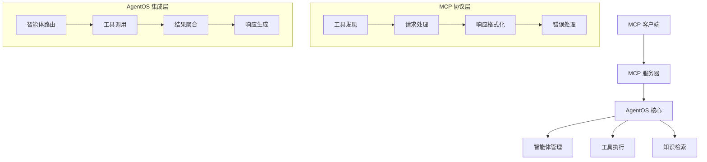

您的 AgentOS 默认情况下将作为 API 暴露。但您也可以将其暴露为 **MCP 服务器**。

这是通过在创建 AgentOS 实例时设置 `enable_mcp_server=True` 来完成的：

```python
agent_os = AgentOS(enable_mcp_server=True)
```

## 为什么使用 MCP？

[MCP 协议](https://modelcontextprotocol.io) 已成为处理将 AI 应用程序与外部工具和数据源连接的行业标准。

通过将您的 AgentOS 暴露为 MCP 服务器，能够处理 MCP 兼容应用程序的外部客户端将能够连接到您的 AgentOS 并与之交互。

## 示例

```python enable_mcp_example.py
from agno.agent import Agent
from agno.db.postgres import PostgresDb
from agno.models.anthropic import Claude
from agno.os import AgentOS
from agno.tools.duckduckgo import DuckDuckGoTools

# 设置数据库
db = PostgresDb(db_url="postgresql+psycopg://ai:ai@localhost:5532/ai")

# 创建您的智能体
web_research_agent = Agent(
    name="网络研究智能体",
    model=Claude(id="claude-sonnet-4-0"),
    db=db,
    tools=[DuckDuckGoTools()],
    markdown=True,
    instructions="""
    你是一个专业的网络研究助手，可以帮助用户搜索和分析网络信息。
    请用简洁、准确的中文回答用户问题。
    提供可靠的搜索结果和分析报告。
    """
)

# 设置启用 MCP 的 AgentOS
agent_os = AgentOS(
    description="启用 MCP 的示例应用程序",
    agents=[web_research_agent],
    enable_mcp_server=True,  # 这会在 /mcp 启用对 LLM 友好的 MCP 服务器
)

app = agent_os.get_app()

# 启动服务器
if __name__ == "__main__":
    agent_os.serve(app="enable_mcp_example:app", reload=True)
```

## MCP 架构概述

### 什么是 MCP？

MCP（Model Context Protocol）是一个开放标准，定义了：

- **通信协议**: AI 模型与外部工具之间的标准化通信
- **工具发现**: 动态发现和描述可用工具
- **资源管理**: 统一的资源访问和管理机制
- **安全认证**: 安全的身份验证和授权流程

### 核心组件



## 高级配置

### 1. 自定义 MCP 服务器配置

```python
from agno.os import AgentOS
from agno.os.mcp import MCPServerConfig

# 自定义 MCP 服务器配置
mcp_config = MCPServerConfig(
    endpoint="/mcp",
    version="2024-11-05",
    capabilities={
        "tools": True,
        "resources": True,
        "prompts": True,
        "logging": True
    },
    server_info={
        "name": "AgentOS MCP 服务器",
        "version": "1.0.0",
        "description": "基于 AgentOS 的智能 MCP 服务器"
    },
    max_request_size=10485760,  # 10MB
    timeout=30,
    enable_cors=True,
    allowed_origins=["*"],
    rate_limiting={
        "requests_per_minute": 1000,
        "burst_size": 100
    }
)

# 创建带自定义配置的 AgentOS
agent_os = AgentOS(
    agents=[web_research_agent],
    enable_mcp_server=True,
    mcp_config=mcp_config
)
```

### 2. 多智能体 MCP 服务器

```python
from agno.agent import Agent
from agno.team import Team
from agno.os import AgentOS

# 创建专门的智能体
research_agent = Agent(
    name="研究智能体",
    instructions="负责信息收集和研究分析"
)

analysis_agent = Agent(
    name="分析智能体",
    instructions="负责数据分析和报告生成"
)

creative_agent = Agent(
    name="创意智能体",
    instructions="负责创意内容生成和设计"
)

# 创建智能体团队
content_team = Team(
    name="内容创作团队",
    agents=[research_agent, analysis_agent, creative_agent],
    instructions="团队协作完成高质量内容创作"
)

# 创建多智能体 MCP 服务器
agent_os = AgentOS(
    agents=[research_agent, analysis_agent, creative_agent, content_team],
    enable_mcp_server=True,
    mcp_config=MCPServerConfig(
        server_info={
            "name": "多智能体 MCP 服务器",
            "description": "提供多种专业智能体服务的 MCP 服务器"
        }
    )
)
```

### 3. 工具和资源管理

```python
from agno.tools.file import FileTools
from agno.tools.calculator import CalculatorTools
from agno.tools.weather import WeatherTools
from agno.knowledge.knowledge import Knowledge
from agno.vectordb.pgvector import PgVector

# 创建知识库
knowledge_base = Knowledge(
    vector_db=PgVector(db_url=db_url, table_name="mcp_knowledge"),
    reader=PdfReader()
)

# 创建带丰富工具的智能体
multi_tool_agent = Agent(
    name="多功能助手",
    tools=[
        FileTools(),
        CalculatorTools(),
        WeatherTools()
    ],
    knowledge=knowledge_base,
    instructions="""
    你是一个多功能智能助手，可以：
    - 处理文件操作
    - 进行数学计算
    - 提供天气信息
    - 检索知识库内容
    
    请根据用户需求选择合适的工具完成任务。
    """
)

# 启用工具和资源的 MCP 服务器
agent_os = AgentOS(
    agents=[multi_tool_agent],
    enable_mcp_server=True,
    mcp_config=MCPServerConfig(
        capabilities={
            "tools": True,
            "resources": True,
            "knowledge": True
        }
    )
)
```

## MCP 客户端集成

### 1. Python MCP 客户端

```python
import asyncio
import json
from mcp import Client

class AgentOSMCPClient:
    def __init__(self, server_url: str):
        self.server_url = server_url
        self.client = None
    
    async def connect(self):
        """连接到 MCP 服务器"""
        self.client = Client(self.server_url)
        await self.client.initialize()
        
        # 获取服务器信息
        server_info = await self.client.get_server_info()
        print(f"连接到服务器: {server_info['name']}")
        
        return server_info
    
    async def list_tools(self):
        """列出可用工具"""
        tools = await self.client.list_tools()
        
        print("可用工具:")
        for tool in tools:
            print(f"- {tool['name']}: {tool['description']}")
        
        return tools
    
    async def call_tool(self, tool_name: str, arguments: dict):
        """调用工具"""
        try:
            result = await self.client.call_tool(tool_name, arguments)
            return result
        except Exception as e:
            return {"error": str(e)}
    
    async def list_resources(self):
        """列出可用资源"""
        resources = await self.client.list_resources()
        
        print("可用资源:")
        for resource in resources:
            print(f"- {resource['uri']}: {resource['name']}")
        
        return resources
    
    async def read_resource(self, uri: str):
        """读取资源"""
        try:
            content = await self.client.read_resource(uri)
            return content
        except Exception as e:
            return {"error": str(e)}

# 使用 MCP 客户端
async def main():
    client = AgentOSMCPClient("http://localhost:8000/mcp")
    
    # 连接服务器
    server_info = await client.connect()
    
    # 列出工具
    tools = await client.list_tools()
    
    # 调用工具示例
    if tools:
        tool_name = tools[0]['name']
        result = await client.call_tool(tool_name, {"query": "人工智能发展趋势"})
        print(f"工具调用结果: {result}")
    
    # 列出资源
    resources = await client.list_resources()

if __name__ == "__main__":
    asyncio.run(main())
```

### 2. Claude Desktop 集成

```json
{
  "mcpServers": {
    "agentos": {
      "command": "python",
      "args": [
        "-m", "agno.os.mcp.server",
        "--server-url", "http://localhost:8000/mcp"
      ],
      "env": {
        "OPENAI_API_KEY": "your-openai-api-key",
        "ANTHROPIC_API_KEY": "your-anthropic-api-key"
      }
    }
}
```

### 3. Web 界面集成

```typescript
// MCP Web 客户端示例
import { MCPClient } from '@modelcontextprotocol/client';

class WebMCPClient {
    private client: MCPClient;
    
    constructor(serverUrl: string) {
        this.client = new MCPClient(serverUrl);
    }
    
    async initialize(): Promise<void> {
        await this.client.initialize();
        console.log('MCP 客户端已初始化');
    }
    
    async listTools(): Promise<any[]> {
        const tools = await this.client.listTools();
        return tools.tools || [];
    }
    
    async callTool(name: string, args: any): Promise<any> {
        const result = await this.client.callTool(name, args);
        return result.content;
    }
    
    async listResources(): Promise<any[]> {
        const resources = await this.client.listResources();
        return resources.resources || [];
    }
    
    async readResource(uri: string): Promise<any> {
        const content = await this.client.readResource(uri);
        return content.contents;
    }
}

// 使用 Web 客户端
const webClient = new WebMCPClient('ws://localhost:8000/mcp');

async function initializeClient() {
    try {
        await webClient.initialize();
        
        const tools = await webClient.listTools();
        console.log('可用工具:', tools);
        
        if (tools.length > 0) {
            const result = await webClient.callTool(tools[0].name, {
                query: "最新技术趋势"
            });
            console.log('工具调用结果:', result);
        }
        
    } catch (error) {
        console.error('初始化失败:', error);
    }
}

initializeClient();
```

## 监控和调试

### 1. MCP 服务器监控

```python
import time
import asyncio
from collections import defaultdict
from typing import Dict, List, Any

class MCPServerMonitor:
    def __init__(self):
        self.metrics = defaultdict(lambda: {
            "request_count": 0,
            "total_response_time": 0.0,
            "error_count": 0,
            "tool_usage": defaultdict(int),
            "resource_usage": defaultdict(int)
        })
    
    async def track_request(self, request_type: str, tool_name: str = None, 
                          response_time: float = 0.0, success: bool = True):
        """跟踪请求指标"""
        metrics = self.metrics[request_type]
        
        metrics["request_count"] += 1
        metrics["total_response_time"] += response_time
        
        if tool_name:
            metrics["tool_usage"][tool_name] += 1
        
        if not success:
            metrics["error_count"] += 1
    
    def get_performance_report(self) -> Dict[str, Any]:
        """获取性能报告"""
        report = {}
        
        for request_type, metrics in self.metrics.items():
            if metrics["request_count"] > 0:
                avg_response_time = metrics["total_response_time"] / metrics["request_count"]
                error_rate = metrics["error_count"] / metrics["request_count"]
                
                report[request_type] = {
                    "request_count": metrics["request_count"],
                    "avg_response_time": f"{avg_response_time:.3f}s",
                    "error_rate": f"{error_rate:.2%}",
                    "most_used_tools": dict(sorted(
                        metrics["tool_usage"].items(),
                        key=lambda x: x[1],
                        reverse=True
                    )[:5]),
                    "most_accessed_resources": dict(sorted(
                        metrics["resource_usage"].items(),
                        key=lambda x: x[1],
                        reverse=True
                    )[:5])
                }
        
        return report

# 集成监控到 AgentOS
monitor = MCPServerMonitor()

class MonitoredAgentOS(AgentOS):
    async def handle_mcp_request(self, request):
        """处理 MCP 请求并监控"""
        start_time = time.time()
        request_type = request.get("method", "unknown")
        tool_name = None
        
        try:
            # 提取工具名称
            if request_type == "tools/call":
                tool_name = request.get("params", {}).get("name")
            
            # 处理请求
            result = await super().handle_mcp_request(request)
            
            # 记录成功指标
            response_time = time.time() - start_time
            await monitor.track_request(
                request_type, tool_name, response_time, success=True
            )
            
            return result
            
        except Exception as e:
            # 记录失败指标
            response_time = time.time() - start_time
            await monitor.track_request(
                request_type, tool_name, response_time, success=False
            )
            
            raise

# 使用监控的 AgentOS
agent_os = MonitoredAgentOS(
    agents=[web_research_agent],
    enable_mcp_server=True
)
```

### 2. 调试工具

```python
import json
import asyncio
from typing import Dict, Any

class MCPDebugger:
    def __init__(self, server_url: str):
        self.server_url = server_url
    
    async def test_connection(self):
        """测试连接"""
        try:
            client = AgentOSMCPClient(self.server_url)
            server_info = await client.connect()
            
            print("✅ 连接成功")
            print(f"服务器: {server_info['name']}")
            print(f"版本: {server_info['version']}")
            
            return True
            
        except Exception as e:
            print(f"❌ 连接失败: {e}")
            return False
    
    async def test_tools(self):
        """测试工具功能"""
        try:
            client = AgentOSMCPClient(self.server_url)
            await client.connect()
            
            tools = await client.list_tools()
            print(f"📋 发现 {len(tools)} 个工具")
            
            # 测试每个工具
            for tool in tools[:3]:  # 只测试前3个工具
                tool_name = tool['name']
                print(f"🔧 测试工具: {tool_name}")
                
                # 使用测试参数
                test_args = self._get_test_args(tool)
                if test_args:
                    result = await client.call_tool(tool_name, test_args)
                    print(f"✅ {tool_name} 测试成功")
                else:
                    print(f"⚠️ {tool_name} 跳过测试（无合适参数）")
            
            return True
            
        except Exception as e:
            print(f"❌ 工具测试失败: {e}")
            return False
    
    def _get_test_args(self, tool: Dict[str, Any]) -> Dict[str, Any]:
        """获取工具测试参数"""
        tool_name = tool['name'].lower()
        
        if 'search' in tool_name or 'research' in tool_name:
            return {"query": "测试查询"}
        elif 'calculate' in tool_name or 'math' in tool_name:
            return {"expression": "2 + 2"}
        elif 'weather' in tool_name:
            return {"location": "北京"}
        elif 'file' in tool_name:
            return {"action": "list", "path": "."}
        else:
            return {}
    
    async def test_resources(self):
        """测试资源功能"""
        try:
            client = AgentOSMCPClient(self.server_url)
            await client.connect()
            
            resources = await client.list_resources()
            print(f"📚 发现 {len(resources)} 个资源")
            
            # 测试读取资源
            for resource in resources[:3]:  # 只测试前3个资源
                uri = resource['uri']
                print(f"📖 测试资源: {uri}")
                
                try:
                    content = await client.read_resource(uri)
                    print(f"✅ {uri} 读取成功")
                except Exception as e:
                    print(f"❌ {uri} 读取失败: {e}")
            
            return True
            
        except Exception as e:
            print(f"❌ 资源测试失败: {e}")
            return False
    
    async def run_full_diagnostics(self):
        """运行完整诊断"""
        print("🚀 开始 MCP 服务器诊断")
        print("=" * 50)
        
        # 测试连接
        connection_ok = await self.test_connection()
        if not connection_ok:
            return False
        
        # 测试工具
        tools_ok = await self.test_tools()
        
        # 测试资源
        resources_ok = await self.test_resources()
        
        print("=" * 50)
        print("📊 诊断结果:")
        print(f"连接: {'✅ 正常' if connection_ok else '❌ 异常'}")
        print(f"工具: {'✅ 正常' if tools_ok else '❌ 异常'}")
        print(f"资源: {'✅ 正常' if resources_ok else '❌ 异常'}")
        
        return connection_ok and tools_ok and resources_ok

# 使用调试工具
async def debug_mcp_server():
    debugger = MCPDebugger("http://localhost:8000/mcp")
    await debugger.run_full_diagnostics()

if __name__ == "__main__":
    asyncio.run(debug_mcp_server())
```

## 最佳实践

### 1. 服务器配置

- **合理的超时设置**: 根据工具复杂度设置适当的超时时间
- **资源限制**: 设置合理的请求大小和并发限制
- **安全配置**: 启用适当的认证和授权机制
- **监控启用**: 启用详细的日志和监控

### 2. 工具设计

- **清晰的描述**: 为每个工具提供清晰的中文描述
- **参数验证**: 实施严格的参数验证
- **错误处理**: 提供友好的错误消息
- **性能优化**: 优化工具执行性能

### 3. 客户端集成

- **连接管理**: 实施连接池和重连机制
- **错误恢复**: 实施优雅的错误恢复
- **缓存策略**: 缓存常用工具和资源信息
- **超时处理**: 设置合理的客户端超时

## 故障排除

### 常见问题

#### 连接超时

**问题**: MCP 客户端连接超时
**解决方案**:
1. 检查服务器是否正常运行
2. 验证网络连接和防火墙设置
3. 调整超时配置
4. 检查服务器负载

#### 工具调用失败

**问题**: 工具调用返回错误
**解决方案**:
1. 检查工具参数格式
2. 验证工具可用性
3. 查看服务器日志
4. 测试工具独立功能

#### 资源访问失败

**问题**: 无法读取资源
**解决方案**:
1. 检查资源 URI 格式
2. 验证资源权限
3. 确认资源存在
4. 检查资源配置

## 下一步

- 查看[MCP 工具](/agent-os/mcp/tools)
- 了解[AgentOS 配置](/agent-os/config)
- 探索[中间件功能](/agent-os/middleware)
- 查看[安全功能](/agent-os/security)