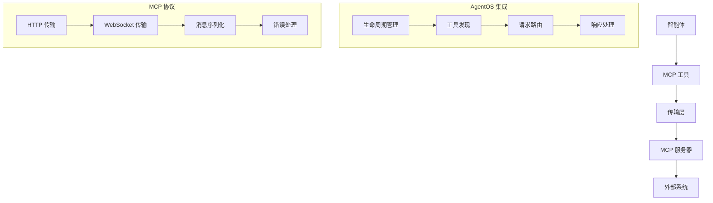

[模型上下文协议（MCP）](https://modelcontextprotocol.io)使智能体能够通过标准化接口与外部系统交互。

您可以使用 `MCPTools` 类为您的智能体提供 MCP 工具访问权限。有关使用 MCP 工具的更多信息，请阅读[这里](/basics/tools/mcp/overview)。

您的 `MCPTools` 在 AgentOS 中将正常工作。它们的生命周期会自动处理，您无需处理连接和断开连接。

<Note>
如果您在 AgentOS 中使用 `MCPTools`，则在提供 AgentOS 服务时不应使用 `reload=True`。
这可能会在 FastAPI 生命周期期间破坏 MCP 连接。
</Note>

## 示例

```python mcp_tools_example.py
from agno.agent import Agent
from agno.os import AgentOS
from agno.tools.mcp import MCPTools

# 创建 MCPTools 实例
mcp_tools = MCPTools(
    transport="streamable-http",
    url="https://docs.agno.com/mcp"
)

# 创建启用 MCP 的智能体
agent = Agent(
    id="agno-agent",
    name="Agno 智能体",
    tools=[mcp_tools],
    instructions="""
    你是一个配备了 MCP 工具的智能助手。
    可以使用各种外部工具来完成任务。
    请根据用户需求选择合适的工具。
    """
)

# AgentOS 管理 MCP 生命周期
agent_os = AgentOS(
    description="带有 MCP 工具的 AgentOS",
    agents=[agent],
)

app = agent_os.get_app()

if __name__ == "__main__":
    # 不要使用 reload=True 与 MCP 工具以避免生命周期问题
    agent_os.serve(app="mcp_tools_example:app")
```

## MCP 工具架构

### 核心组件



## 高级配置

### 1. 多种传输方式

```python
from agno.tools.mcp import MCPTools
from agno.agent import Agent

# HTTP 传输
http_tools = MCPTools(
    transport="http",
    url="http://localhost:3000/mcp",
    headers={"Authorization": "Bearer token123"},
    timeout=30
)

# WebSocket 传输
ws_tools = MCPTools(
    transport="websocket",
    url="ws://localhost:3000/mcp",
    reconnect_interval=5,
    max_reconnect_attempts=10
)

# 流式 HTTP 传输
streamable_tools = MCPTools(
    transport="streamable-http",
    url="http://localhost:3000/mcp",
    stream_response=True,
    chunk_size=1024
)

# 创建带多种传输的智能体
multi_transport_agent = Agent(
    name="多传输智能体",
    tools=[http_tools, ws_tools, streamable_tools],
    instructions="""
    你可以使用多种传输方式连接不同的 MCP 服务器。
    根据任务需求选择最合适的传输方式。
    """
)
```

### 2. 自定义 MCP 工具配置

```python
from agno.tools.mcp import MCPTools, MCPConfig

# 自定义 MCP 配置
mcp_config = MCPConfig(
    # 连接配置
    connection_timeout=30,
    read_timeout=60,
    write_timeout=60,
    
    # 重连配置
    auto_reconnect=True,
    max_reconnect_attempts=5,
    reconnect_delay=1.0,
    reconnect_backoff_factor=2.0,
    
    # 缓存配置
    enable_cache=True,
    cache_ttl=300,  # 5 分钟
    cache_size=1000,
    
    # 日志配置
    enable_logging=True,
    log_level="INFO",
    log_requests=True,
    log_responses=False,
    
    # 安全配置
    verify_ssl=True,
    allowed_hosts=["localhost", "api.example.com"],
    api_key="your-api-key"
)

# 使用自定义配置
custom_tools = MCPTools(
    transport="http",
    url="https://api.example.com/mcp",
    config=mcp_config
)
```

### 3. 工具发现和管理

```python
from agno.tools.mcp import MCPTools
import asyncio

class AdvancedMCPTools(MCPTools):
    def __init__(self, **kwargs):
        super().__init__(**kwargs)
        self.discovered_tools = {}
        self.tool_usage_stats = {}
    
    async def discover_tools(self):
        """发现可用工具"""
        try:
            tools = await self.list_tools()
            
            for tool in tools:
                tool_name = tool['name']
                self.discovered_tools[tool_name] = {
                    'description': tool.get('description', ''),
                    'input_schema': tool.get('inputSchema', {}),
                    'last_seen': asyncio.get_event_loop().time()
                }
                
                # 初始化使用统计
                if tool_name not in self.tool_usage_stats:
                    self.tool_usage_stats[tool_name] = {
                        'usage_count': 0,
                        'success_count': 0,
                        'error_count': 0,
                        'avg_response_time': 0.0
                    }
            
            print(f"发现 {len(tools)} 个工具")
            return tools
            
        except Exception as e:
            print(f"工具发现失败: {e}")
            return []
    
    async def get_tool_recommendations(self, task_description):
        """根据任务描述推荐工具"""
        recommendations = []
        
        for tool_name, tool_info in self.discovered_tools.items():
            description = tool_info['description'].lower()
            task_desc = task_description.lower()
            
            # 简单的关键词匹配
            if any(keyword in description for keyword in task_desc.split()):
                recommendations.append({
                    'tool': tool_name,
                    'description': tool_info['description'],
                    'confidence': self._calculate_confidence(description, task_desc)
                })
        
        # 按置信度排序
        recommendations.sort(key=lambda x: x['confidence'], reverse=True)
        
        return recommendations[:5]  # 返回前5个推荐
    
    def _calculate_confidence(self, tool_desc, task_desc):
        """计算推荐置信度"""
        common_words = set(tool_desc.split()) & set(task_desc.split())
        total_words = len(set(task_desc.split()))
        
        if total_words == 0:
            return 0.0
        
        return len(common_words) / total_words
    
    async def track_tool_usage(self, tool_name, success=True, response_time=0.0):
        """跟踪工具使用情况"""
        if tool_name in self.tool_usage_stats:
            stats = self.tool_usage_stats[tool_name]
            stats['usage_count'] += 1
            
            if success:
                stats['success_count'] += 1
            else:
                stats['error_count'] += 1
            
            # 更新平均响应时间
            total_time = stats['avg_response_time'] * (stats['usage_count'] - 1) + response_time
            stats['avg_response_time'] = total_time / stats['usage_count']
    
    def get_usage_report(self):
        """获取使用报告"""
        report = {}
        
        for tool_name, stats in self.tool_usage_stats.items():
            if stats['usage_count'] > 0:
                success_rate = stats['success_count'] / stats['usage_count']
                
                report[tool_name] = {
                    'usage_count': stats['usage_count'],
                    'success_rate': f"{success_rate:.2%}",
                    'avg_response_time': f"{stats['avg_response_time']:.3f}s",
                    'error_count': stats['error_count']
                }
        
        return report

# 使用高级 MCP 工具
advanced_tools = AdvancedMCPTools(
    transport="http",
    url="https://api.example.com/mcp"
)
```

## 团队和工作流集成

### 1. 团队中的 MCP 工具

```python
from agno.agent import Agent
from agno.team import Team
from agno.tools.mcp import MCPTools

# 创建专门的 MCP 工具集
file_tools = MCPTools(
    transport="http",
    url="http://localhost:3001/mcp",
    name="file-operations"
)

database_tools = MCPTools(
    transport="websocket", 
    url="ws://localhost:3002/mcp",
    name="database-operations"
)

api_tools = MCPTools(
    transport="streamable-http",
    url="https://api.example.com/mcp",
    name="api-operations"
)

# 创建专门角色的智能体
file_agent = Agent(
    name="文件管理员",
    tools=[file_tools],
    instructions="负责文件操作和管理"
)

db_agent = Agent(
    name="数据库管理员", 
    tools=[database_tools],
    instructions="负责数据库查询和维护"
)

api_agent = Agent(
    name="API 集成专家",
    tools=[api_tools],
    instructions="负责外部 API 调用和数据集成"
)

# 创建协作团队
operations_team = Team(
    name="运维团队",
    agents=[file_agent, db_agent, api_agent],
    instructions="""
    我们是一个专业的运维团队，协作处理各种系统操作任务。
    根据任务类型自动分配给合适的专家。
    确保操作的安全性和效率。
    """
)

# 集成到 AgentOS
agent_os = AgentOS(
    agents=[file_agent, db_agent, api_agent, operations_team],
    enable_mcp_server=True
)
```

### 2. 工作流中的 MCP 工具

```python
from agno.workflow import Workflow, WorkflowStep
from agno.tools.mcp import MCPTools

# 创建工作流步骤
class DataIngestionStep(WorkflowStep):
    def __init__(self, mcp_tools):
        super().__init__()
        self.mcp_tools = mcp_tools
    
    async def run(self, input_data):
        """数据摄取步骤"""
        # 使用 MCP 工具连接数据源
        data_source = input_data.get("data_source")
        
        # 发现并使用合适的工具
        tools = await self.mcp_tools.discover_tools()
        recommendations = await self.mcp_tools.get_tool_recommendations(
            f"连接到 {data_source} 数据源"
        )
        
        if recommendations:
            best_tool = recommendations[0]['tool']
            
            try:
                result = await self.mcp_tools.call_tool(best_tool, {
                    "action": "connect",
                    "source": data_source
                })
                
                return {
                    "status": "success",
                    "data": result,
                    "tool_used": best_tool
                }
                
            except Exception as e:
                return {
                    "status": "error", 
                    "error": str(e),
                    "tool_used": best_tool
                }
        
        return {"status": "no_tools_available"}

class DataProcessingStep(WorkflowStep):
    def __init__(self, mcp_tools):
        super().__init__()
        self.mcp_tools = mcp_tools
    
    async def run(self, input_data):
        """数据处理步骤"""
        raw_data = input_data.get("data")
        processing_type = input_data.get("processing_type", "transform")
        
        # 获取数据处理工具
        recommendations = await self.mcp_tools.get_tool_recommendations(
            f"数据 {processing_type} 处理"
        )
        
        results = []
        
        for recommendation in recommendations[:3]:  # 尝试前3个推荐工具
            tool_name = recommendation['tool']
            
            try:
                result = await self.mcp_tools.call_tool(tool_name, {
                    "data": raw_data,
                    "operation": processing_type
                })
                
                results.append({
                    "tool": tool_name,
                    "result": result,
                    "success": True
                })
                
            except Exception as e:
                results.append({
                    "tool": tool_name,
                    "error": str(e),
                    "success": False
                })
        
        return {"processing_results": results}

# 创建工作流
data_workflow = Workflow(
    name="数据处理工作流",
    steps=[
        DataIngestionStep(mcp_tools),
        DataProcessingStep(mcp_tools)
    ]
)

# 集成到 AgentOS
agent_os = AgentOS(
    workflows=[data_workflow],
    agents=[file_agent, db_agent, api_agent],
    enable_mcp_server=True
)
```

## 监控和调试

### 1. MCP 工具监控

```python
import time
import asyncio
from collections import defaultdict
from typing import Dict, List, Any

class MCPToolsMonitor:
    def __init__(self):
        self.metrics = defaultdict(lambda: {
            "call_count": 0,
            "success_count": 0,
            "error_count": 0,
            "total_response_time": 0.0,
            "last_called": None
        })
    
    async def track_tool_call(self, tool_name: str, success: bool, response_time: float):
        """跟踪工具调用"""
        metrics = self.metrics[tool_name]
        metrics["call_count"] += 1
        metrics["last_called"] = time.time()
        metrics["total_response_time"] += response_time
        
        if success:
            metrics["success_count"] += 1
        else:
            metrics["error_count"] += 1
    
    def get_performance_report(self) -> Dict[str, Any]:
        """获取性能报告"""
        report = {}
        
        for tool_name, metrics in self.metrics.items():
            if metrics["call_count"] > 0:
                success_rate = metrics["success_count"] / metrics["call_count"]
                avg_response_time = metrics["total_response_time"] / metrics["call_count"]
                
                report[tool_name] = {
                    "call_count": metrics["call_count"],
                    "success_rate": f"{success_rate:.2%}",
                    "avg_response_time": f"{avg_response_time:.3f}s",
                    "error_count": metrics["error_count"],
                    "last_called": time.strftime(
                        "%Y-%m-%d %H:%M:%S", 
                        time.localtime(metrics["last_called"])
                    ) if metrics["last_called"] else "Never"
                }
        
        return report
    
    def identify_problematic_tools(self, error_threshold=0.1) -> List[str]:
        """识别有问题的工具"""
        problematic = []
        
        for tool_name, metrics in self.metrics.items():
            if metrics["call_count"] > 0:
                error_rate = metrics["error_count"] / metrics["call_count"]
                if error_rate > error_threshold:
                    problematic.append(tool_name)
        
        return problematic

# 集成监控到 MCP 工具
monitor = MCPToolsMonitor()

class MonitoredMCPTools(MCPTools):
    async def call_tool(self, tool_name: str, arguments: Dict[str, Any]):
        """带监控的工具调用"""
        start_time = time.time()
        success = False
        
        try:
            result = await super().call_tool(tool_name, arguments)
            success = True
            return result
            
        except Exception as e:
            success = False
            raise
            
        finally:
            response_time = time.time() - start_time
            await monitor.track_tool_call(tool_name, success, response_time)
```

### 2. 调试工具

```python
import json
import asyncio
from typing import Dict, Any

class MCPToolsDebugger:
    def __init__(self, mcp_tools: MCPTools):
        self.mcp_tools = mcp_tools
    
    async def test_connection(self):
        """测试连接"""
        try:
            # 尝试列出工具来测试连接
            tools = await self.mcp_tools.list_tools()
            print(f"✅ 连接成功，发现 {len(tools)} 个工具")
            return True
            
        except Exception as e:
            print(f"❌ 连接失败: {e}")
            return False
    
    async def test_tool_availability(self):
        """测试工具可用性"""
        try:
            tools = await self.mcp_tools.list_tools()
            
            print("🔧 测试工具可用性:")
            available_count = 0
            
            for tool in tools:
                tool_name = tool['name']
                
                try:
                    # 尝试获取工具模式
                    schema = tool.get('inputSchema', {})
                    print(f"✅ {tool_name}: 可用")
                    available_count += 1
                    
                except Exception as e:
                    print(f"❌ {tool_name}: 不可用 - {e}")
            
            print(f"\n📊 可用工具: {available_count}/{len(tools)}")
            return available_count == len(tools)
            
        except Exception as e:
            print(f"❌ 工具可用性测试失败: {e}")
            return False
    
    async def test_tool_functionality(self, tool_name: str, test_args: Dict[str, Any] = None):
        """测试工具功能"""
        try:
            if test_args is None:
                test_args = self._get_default_test_args(tool_name)
            
            print(f"🧪 测试工具: {tool_name}")
            print(f"📝 测试参数: {test_args}")
            
            start_time = time.time()
            result = await self.mcp_tools.call_tool(tool_name, test_args)
            response_time = time.time() - start_time
            
            print(f"✅ {tool_name} 测试成功")
            print(f"⏱️ 响应时间: {response_time:.3f}s")
            print(f"📄 结果: {json.dumps(result, indent=2, ensure_ascii=False)[:200]}...")
            
            return True
            
        except Exception as e:
            print(f"❌ {tool_name} 测试失败: {e}")
            return False
    
    def _get_default_test_args(self, tool_name: str) -> Dict[str, Any]:
        """获取默认测试参数"""
        tool_name_lower = tool_name.lower()
        
        if 'search' in tool_name_lower:
            return {"query": "测试搜索"}
        elif 'calculate' in tool_name_lower:
            return {"expression": "2 + 2"}
        elif 'file' in tool_name_lower:
            return {"action": "list", "path": "."}
        elif 'database' in tool_name_lower:
            return {"query": "SELECT 1"}
        else:
            return {"test": True}
    
    async def run_comprehensive_test(self):
        """运行综合测试"""
        print("🚀 开始 MCP 工具综合测试")
        print("=" * 60)
        
        # 测试连接
        connection_ok = await self.test_connection()
        if not connection_ok:
            return False
        
        # 测试工具可用性
        availability_ok = await self.test_tool_availability()
        
        # 测试工具功能
        tools = await self.mcp_tools.list_tools()
        functionality_tests = []
        
        for tool in tools[:3]:  # 只测试前3个工具
            tool_name = tool['name']
            test_ok = await self.test_tool_functionality(tool_name)
            functionality_tests.append(test_ok)
        
        print("=" * 60)
        print("📊 测试结果:")
        print(f"连接: {'✅ 正常' if connection_ok else '❌ 异常'}")
        print(f"可用性: {'✅ 正常' if availability_ok else '❌ 异常'}")
        print(f"功能性: {'✅ 正常' if all(functionality_tests) else '❌ 异常'}")
        
        return connection_ok and availability_ok and all(functionality_tests)

# 使用调试工具
async def debug_mcp_tools():
    mcp_tools = MCPTools(
        transport="http",
        url="http://localhost:3000/mcp"
    )
    
    debugger = MCPToolsDebugger(mcp_tools)
    await debugger.run_comprehensive_test()

if __name__ == "__main__":
    asyncio.run(debug_mcp_tools())
```

## 最佳实践

### 1. 工具管理

- **工具发现**: 定期发现和更新可用工具列表
- **使用统计**: 跟踪工具使用情况以优化配置
- **错误处理**: 实施优雅的错误处理和重试机制
- **性能监控**: 监控工具响应时间和成功率

### 2. 连接管理

- **连接池**: 使用连接池提高性能
- **自动重连**: 实施自动重连机制
- **超时设置**: 设置合理的连接和读写超时
- **负载均衡**: 在多个服务器间分配负载

### 3. 安全考虑

- **身份验证**: 使用强身份验证机制
- **授权控制**: 实施细粒度的权限控制
- **数据加密**: 加密敏感数据传输
- **访问日志**: 记录详细的访问日志

## 故障排除

### 常见问题

#### 连接失败

**问题**: MCP 工具无法连接到服务器
**解决方案**:
1. 检查服务器 URL 和端口
2. 验证网络连接和防火墙设置
3. 检查身份验证凭据
4. 确认服务器状态

#### 工具调用失败

**问题**: 工具调用返回错误
**解决方案**:
1. 检查工具名称和参数格式
2. 验证工具可用性
3. 查看服务器日志
4. 测试工具独立功能

#### 性能问题

**问题**: 工具响应时间过长
**解决方案**:
1. 启用连接缓存
2. 优化网络配置
3. 调整超时设置
4. 考虑负载均衡

## 下一步

- 查看[MCP 概述](/agent-os/mcp/mcp)
- 了解[AgentOS 配置](/agent-os/config)
- 探索[中间件功能](/agent-os/middleware)
- 查看[安全功能](/agent-os/security)