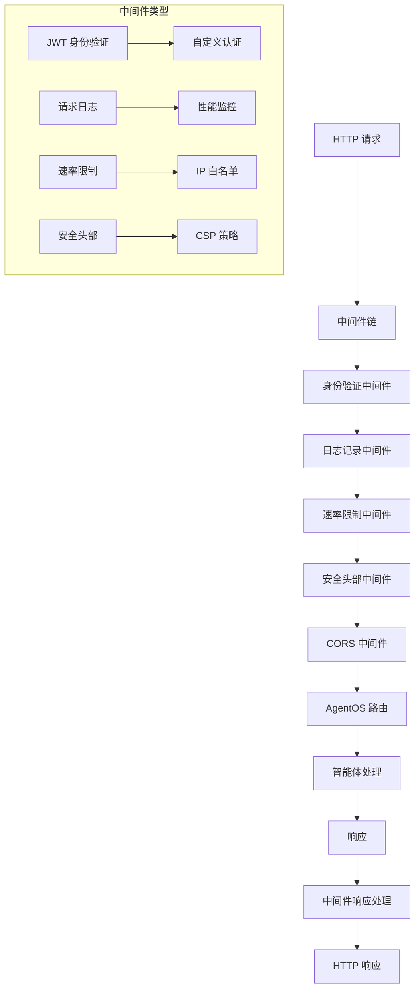

<Badge icon="code-branch" color="orange">
    <Tooltip tip="Introduced in v2.1.0" cta="View release notes" href="https://github.com/agno-agi/agno/releases/tag/v2.1.0">v2.1.0</Tooltip>
</Badge>

AgentOS 基于 FastAPI 构建，允许您添加任何 [FastAPI/Starlette 兼容的中间件](https://fastapi.tiangolo.com/tutorial/middleware/) 用于身份验证、日志记录、监控和安全。Agno 提供内置的 JWT 中间件用于身份验证，您可以创建自定义中间件用于速率限制、请求日志记录和安全头部。

此外，Agno 为常见用例提供了一些内置中间件，包括身份验证。

查看以下指南：
<CardGroup cols={3}>
  <Card
    title="自定义中间件"
    icon="code"
    href="/agent-os/middleware/custom"
  >
    创建您自己的中间件，用于日志记录、速率限制、监控和安全。
  </Card>
  <Card
    title="JWT 中间件"
    icon="key"
    href="/agent-os/middleware/jwt"
  >
    内置 JWT 身份验证，具有自动参数注入和声明提取功能。
  </Card>
  <Card
    title="RBAC"
    icon="lock"
    href="/agent-os/security/rbac"
  >
    使用内置 JWT 中间件实现基于角色的访问控制和细粒度权限范围。
  </Card>
</CardGroup>

## 快速开始

将中间件添加到您的 AgentOS 应用程序非常简单：

```python agent_os.py
from agno.os import AgentOS
from agno.os.middleware import JWTMiddleware
from agno.db.postgres import PostgresDb
from agno.models.openai import OpenAIChat

# 设置数据库
db = PostgresDb(db_url="postgresql+psycopg://ai:ai@localhost:5532/ai")

# 创建智能体
agent = Agent(
    name="示例智能体",
    model=OpenAIChat(id="gpt-4"),
    db=db,
    instructions="你是一个有用的助手。"
)

# 创建带中间件的 AgentOS
agent_os = AgentOS(
    agents=[agent],
    middleware=[
        JWTMiddleware(
            secret_key="your-secret-key",
            algorithm="HS256",
            user_id_header="X-User-ID",
            user_role_header="X-User-Role"
        )
    ]
)

app = agent_os.get_app()

if __name__ == "__main__":
    agent_os.serve(app="agent_os:app", reload=True)
```

## 中间件架构

### 核心组件



## 内置中间件

### 1. JWT 中间件

JWT 中间件提供基于 JSON Web Token 的身份验证：

```python
from agno.os.middleware import JWTMiddleware

jwt_middleware = JWTMiddleware(
    secret_key="your-secret-key",
    algorithm="HS256",
    user_id_header="X-User-ID",
    user_role_header="X-User-Role",
    token_header="Authorization",
    auto_error=True,
    exclude_paths=["/health", "/metrics", "/docs"]
)
```

### 2. CORS 中间件

CORS 中间件处理跨域资源共享：

```python
from agno.os.middleware import CORSMiddleware

cors_middleware = CORSMiddleware(
    allow_origins=["*"],
    allow_credentials=True,
    allow_methods=["*"],
    allow_headers=["*"],
    expose_headers=["X-Total-Count"]
)
```

### 3. 安全头部中间件

安全头部中间件添加重要的安全 HTTP 头部：

```python
from agno.os.middleware import SecurityHeadersMiddleware

security_middleware = SecurityHeadersMiddleware(
    enable_xss_protection=True,
    enable_content_type_options=True,
    enable_hsts=True,
    enable_csp=True,
    csp_policy="default-src 'self'; script-src 'self' 'unsafe-inline'"
)
```

## 中间件配置

### 1. 全局中间件配置

```python
from agno.os import AgentOS
from agno.os.middleware import (
    JWTMiddleware, CORSMiddleware, SecurityHeadersMiddleware,
    RequestLoggingMiddleware, RateLimitMiddleware
)

# 全局中间件配置
global_middleware = [
    # 安全头部（最外层）
    SecurityHeadersMiddleware(),
    
    # CORS 处理
    CORSMiddleware(
        allow_origins=["https://app.example.com"],
        allow_credentials=True,
        allow_methods=["GET", "POST", "PUT", "DELETE"],
        allow_headers=["*"]
    ),
    
    # 速率限制
    RateLimitMiddleware(
        requests_per_minute=100,
        burst_size=20,
        key_func=lambda request: request.client.host
    ),
    
    # 请求日志
    RequestLoggingMiddleware(
        log_level="INFO",
        include_body=False,
        include_headers=True
    ),
    
    # JWT 身份验证
    JWTMiddleware(
        secret_key="your-secret-key",
        algorithm="HS256",
        exclude_paths=["/health", "/metrics", "/docs"]
    )
]

# 应用全局中间件
agent_os = AgentOS(
    agents=[agent],
    middleware=global_middleware
)
```

### 2. 路由特定中间件

```python
from agno.os import AgentOS
from agno.os.middleware import JWTMiddleware, AdminAuthMiddleware

# 为不同路由应用不同中间件
class RouteSpecificMiddleware:
    def __init__(self):
        self.admin_middleware = [
            JWTMiddleware(
                secret_key="admin-secret-key",
                user_role_header="X-Admin-Role",
                required_role="admin"
            ),
            AdminAuthMiddleware()
        ]
        
        self.api_middleware = [
            JWTMiddleware(
                secret_key="api-secret-key",
                user_id_header="X-API-User-ID"
            )
        ]
        
        self.public_middleware = []  # 无身份验证
    
    def get_middleware_for_route(self, route_path):
        """根据路由路径获取适当的中间件"""
        if route_path.startswith("/admin"):
            return self.admin_middleware
        elif route_path.startswith("/api"):
            return self.api_middleware
        else:
            return self.public_middleware

# 创建路由特定中间件管理器
middleware_manager = RouteSpecificMiddleware()

# AgentOS 配置
agent_os = AgentOS(
    agents=[agent],
    middleware=middleware_manager.get_middleware_for_route
)
```

## 中间件执行顺序

中间件按照添加的顺序执行，这对于安全性很重要：

```python
# 正确的中间件顺序
security_middleware = [
    # 1. 首先处理安全头部
    SecurityHeadersMiddleware(),
    
    # 2. 然后 CORS
    CORSMiddleware(),
    
    # 3. 速率限制（在身份验证之前）
    RateLimitMiddleware(),
    
    # 4. 请求日志（记录所有请求）
    RequestLoggingMiddleware(),
    
    # 5. 身份验证（验证用户身份）
    JWTMiddleware(),
    
    # 6. 自定义业务中间件
    CustomBusinessMiddleware(),
    
    # 7. 最后是应用特定的中间件
    ApplicationSpecificMiddleware()
]
```

## 中间件生命周期

### 请求处理流程

```python
from agno.os.middleware import BaseMiddleware

class LifecycleMiddleware(BaseMiddleware):
    async def __call__(self, request, call_next):
        """中间件调用方法"""
        # 1. 请求前处理
        start_time = time.time()
        request_id = self.generate_request_id()
        request.state.request_id = request_id
        
        try:
            # 2. 调用下一个中间件或路由处理器
            response = await call_next(request)
            
            # 3. 响应后处理
            processing_time = time.time() - start_time
            response.headers["X-Processing-Time"] = str(processing_time)
            response.headers["X-Request-ID"] = request_id
            
            # 4. 记录指标
            await self.record_metrics(request, response, processing_time)
            
            return response
            
        except Exception as e:
            # 5. 错误处理
            await self.handle_error(request, e, request_id)
            raise
    
    def generate_request_id(self):
        """生成唯一请求 ID"""
        import uuid
        return str(uuid.uuid4())
    
    async def record_metrics(self, request, response, processing_time):
        """记录性能指标"""
        metrics = {
            "method": request.method,
            "path": request.url.path,
            "status_code": response.status_code,
            "processing_time": processing_time,
            "timestamp": time.time()
        }
        
        # 发送到监控系统
        await self.send_to_metrics(metrics)
    
    async def send_to_metrics(self, metrics):
        """发送指标到监控系统"""
        # 实现指标发送逻辑
        pass
    
    async def handle_error(self, request, error, request_id):
        """处理错误"""
        error_metrics = {
            "method": request.method,
            "path": request.url.path,
            "error_type": type(error).__name__,
            "request_id": request_id,
            "timestamp": time.time()
        }
        
        await self.send_error_metrics(error_metrics)
```

## 最佳实践

### 1. 中间件设计原则

- **单一职责**: 每个中间件只负责一个特定功能
- **幂等性**: 中间件应该是幂等的，可以安全重试
- **可测试性**: 中间件应该易于单独测试
- **可配置性**: 提供灵活的配置选项

### 2. 性能考虑

- **轻量级**: 保持中间件逻辑简单高效
- **异步操作**: 使用异步操作避免阻塞
- **缓存策略**: 合理使用缓存提高性能
- **连接池**: 复用数据库和外部服务连接

### 3. 安全最佳实践

- **深度防御**: 多层安全控制
- **最小权限**: 只授予必要的权限
- **输入验证**: 验证所有输入数据
- **安全头部**: 设置适当的安全 HTTP 头部

### 4. 监控和日志

- **结构化日志**: 使用结构化日志格式
- **性能指标**: 收集详细的性能指标
- **错误跟踪**: 实施全面的错误跟踪
- **告警机制**: 设置智能告警规则

## 故障排除

### 常见问题

#### 中间件顺序错误

**问题**: 中间件执行顺序导致认证失败
**解决方案**:
1. 检查中间件添加顺序
2. 确保身份验证中间件在适当位置
3. 验证路由排除配置
4. 测试中间件链

#### 性能问题

**问题**: 中间件导致响应时间过长
**解决方案**:
1. 分析中间件执行时间
2. 优化慢速中间件
3. 使用异步操作
4. 实施缓存策略

#### 认证失败

**问题**: JWT 中间件认证失败
**解决方案**:
1. 检查密钥配置
2. 验证令牌格式
3. 确认时钟同步
4. 检查令牌过期时间

## 下一步

- 查看[自定义中间件](/agent-os/middleware/custom)
- 了解[JWT 中间件](/agent-os/middleware/jwt)
- 探索[安全功能](/agent-os/security)
- 查看[AgentOS 配置](/agent-os/config)