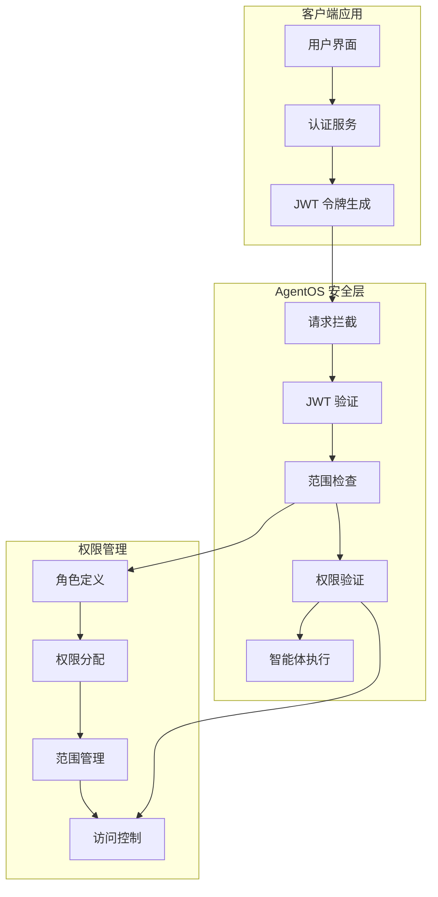
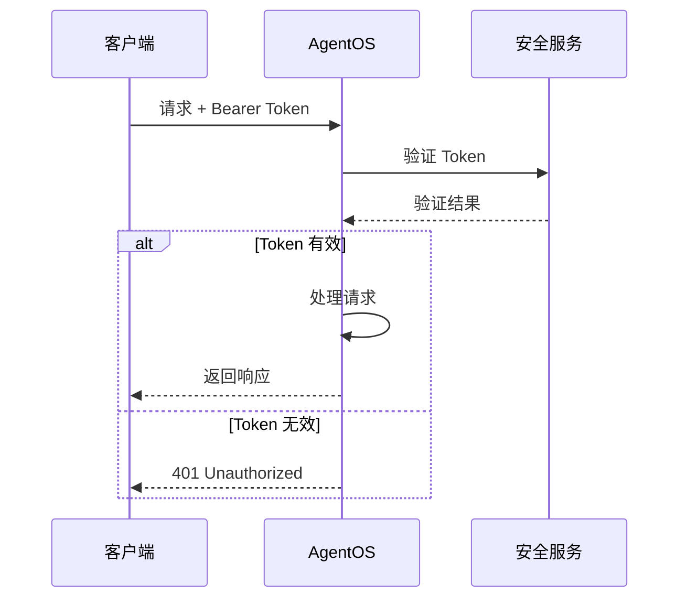
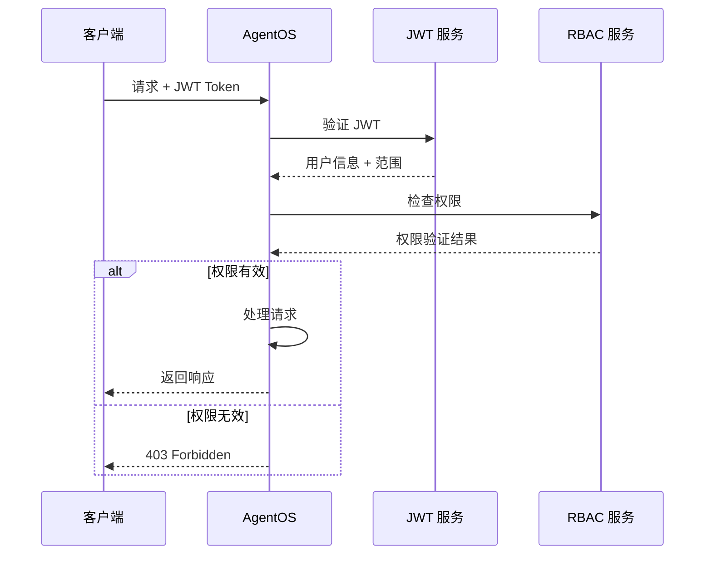

保护您的智能体系统至关重要，AgentOS 内置支持两种安全机制：
- **基本身份验证** -> 用于开发或产品 MVP 阶段的简单密钥验证。不推荐用于生产系统。
- **基于角色的访问控制 (RBAC)**: 基于 JWT 的验证，确保只有授权用户才能发出请求。

## 基本身份验证

基本身份验证为保护您的 AgentOS 实例提供了简单的 bearer-token 身份验证。这也被称为"安全密钥身份验证"。

### 配置

设置 `OS_SECURITY_KEY` 环境变量：

```bash
export OS_SECURITY_KEY="OSK_...您的密钥..."
```

然后运行您的 AgentOS 应用程序：

```python agent_os.py
from agno.os import AgentOS

agent_os = AgentOS(
    id="my-agent-os",
    agents=[my_agent],
)

if __name__ == "__main__":
    agent_os.serve(app="agent_os:app", reload=True)
```

<Note>
当配置了 `OS_SECURITY_KEY` 时，没有有效 `Authorization: Bearer <key>` 头部的请求将返回 `401 Unauthorized`。
</Note>

## 基于角色的访问控制 (RBAC)

AgentOS 提供内置的基于角色的访问控制 (RBAC) 来保护您的整个智能体系统。
RBAC 使用 [JWT 令牌](https://www.jwt.io/introduction) 验证发出请求的用户身份。
无论用户是来自 AgentOS 控制平面还是您自己的应用程序，都会验证 JWT 令牌，并检查范围是否符合每个端点所需的权限。

在 [RBAC](/agent-os/security/rbac) 文档中了解更多关于 AgentOS RBAC 中身份和授权流程的信息。

### 启用 RBAC

要启用 RBAC，您需要配置以下环境变量：

```bash
# JWT 密钥配置
export OS_JWT_SECRET_KEY="your-jwt-secret-key"

# 可选：JWT 算法（默认为 HS256）
export OS_JWT_ALGORITHM="HS256"

# 可选：令牌过期时间（默认为 24 小时）
export OS_JWT_EXPIRE_MINUTES="1440"

# 可选：发行者（可选验证）
export OS_JWT_ISSUER="your-issuer"

# 可选：受众（可选验证）
export OS_JWT_AUDIENCE="your-audience"
```

然后运行您的 AgentOS 应用程序：

```python agent_os.py
from agno.os import AgentOS

agent_os = AgentOS(
    id="my-agent-os",
    agents=[my_agent],
    # RBAC 会自动启用当 JWT 密钥配置时
)

if __name__ == "__main__":
    agent_os.serve(app="agent_os:app", reload=True)
```

### 安全架构



## 认证流程

### 1. 基本认证流程



### 2. RBAC 认证流程



## 安全最佳实践

### 1. 密钥管理

- **强密钥**: 使用至少 32 字符的随机字符串作为 JWT 密钥
- **密钥轮换**: 定期轮换 JWT 密钥以提高安全性
- **环境变量**: 使用环境变量存储敏感配置，不要硬编码
- **密钥分离**: 为不同环境使用不同的密钥

```python
# 生成强 JWT 密钥
import secrets
import base64

# 生成 256 位 (32 字节) 密钥
secret_key = base64.urlsafe_b64encode(secrets.token_bytes(32)).decode()
print(f"JWT 密钥: {secret_key}")
```

### 2. 令牌安全

- **过期时间**: 设置合理的令牌过期时间
- **刷新机制**: 实施令牌刷新机制
- **撤销支持**: 支持令牌撤销功能
- **范围限制**: 使用最小权限原则分配范围

```python
# JWT 令牌配置示例
jwt_config = {
    "secret_key": "your-strong-secret-key",
    "algorithm": "HS256",
    "expire_minutes": 60,  # 1 小时过期
    "issuer": "your-app",
    "audience": "your-users",
    "scopes": {
        "read": "读取权限",
        "write": "写入权限",
        "admin": "管理员权限"
    }
}
```

### 3. 网络安全

- **HTTPS**: 始终在生产环境中使用 HTTPS
- **CORS**: 配置适当的 CORS 策略
- **速率限制**: 实施请求速率限制
- **输入验证**: 验证所有输入数据

```python
# CORS 配置示例
cors_config = {
    "allow_origins": ["https://yourapp.com"],
    "allow_credentials": True,
    "allow_methods": ["GET", "POST", "PUT", "DELETE"],
    "allow_headers": ["Authorization", "Content-Type"]
}

# 速率限制配置
rate_limit_config = {
    "requests_per_minute": 100,
    "burst_size": 20,
    "key_func": lambda request: request.client.host
}
```

### 4. 监控和审计

- **访问日志**: 记录所有访问尝试
- **安全事件**: 监控可疑活动
- **异常检测**: 实施异常行为检测
- **定期审计**: 定期审查安全配置

```python
# 安全监控示例
class SecurityMonitor:
    def __init__(self):
        self.failed_attempts = {}
        self.suspicious_ips = set()
    
    def log_access_attempt(self, request, success):
        """记录访问尝试"""
        client_ip = request.client.host
        timestamp = time.time()
        
        if not success:
            if client_ip not in self.failed_attempts:
                self.failed_attempts[client_ip] = []
            
            self.failed_attempts[client_ip].append(timestamp)
            
            # 检查可疑活动
            recent_failures = [
                t for t in self.failed_attempts[client_ip]
                if timestamp - t < 300  # 5 分钟内
            ]
            
            if len(recent_failures) > 10:
                self.suspicious_ips.add(client_ip)
                self.alert_suspicious_activity(client_ip)
    
    def alert_suspicious_activity(self, client_ip):
        """警报可疑活动"""
        print(f"警告: 检测到来自 {client_ip} 的可疑活动")
        # 发送告警通知
```

## 常见安全威胁

### 1. 令牌泄露

**威胁**: JWT 令牌被恶意获取
**防护措施**:
- 使用 HTTPS 传输令牌
- 设置合理的过期时间
- 实施令牌刷新机制
- 监控异常使用模式

### 2. 权限提升

**威胁**: 用户获得超出其角色的权限
**防护措施**:
- 严格验证权限范围
- 实施最小权限原则
- 定期审查用户权限
- 记录权限变更日志

### 3. 重放攻击

**威胁**: 攻击者重放有效的请求
**防护措施**:
- 使用时间戳验证
- 实施请求唯一性检查
- 限制令牌使用次数
- 监控重复请求模式

### 4. 中间人攻击

**威胁**: 攻击者拦截和修改通信
**防护措施**:
- 使用 TLS/SSL 加密
- 验证服务器证书
- 实施证书固定
- 使用安全的通信协议

## 安全配置示例

### 1. 开发环境配置

```python
# development.py
import os
from agno.os import AgentOS

# 开发环境安全配置
os.environ["OS_SECURITY_KEY"] = "dev-key-not-for-production"
os.environ["OS_JWT_SECRET_KEY"] = "dev-jwt-secret"
os.environ["OS_JWT_EXPIRE_MINUTES"] = "1440"  # 24 小时

agent_os = AgentOS(
    id="dev-agent-os",
    agents=[my_agent],
    debug_mode=True
)

if __name__ == "__main__":
    agent_os.serve(app="dev:app", reload=True)
```

### 2. 生产环境配置

```python
# production.py
import os
from agno.os import AgentOS

# 生产环境安全配置
os.environ["OS_SECURITY_KEY"] = os.getenv("OS_SECURITY_KEY")
os.environ["OS_JWT_SECRET_KEY"] = os.getenv("OS_JWT_SECRET_KEY")
os.environ["OS_JWT_ALGORITHM"] = "RS256"
os.environ["OS_JWT_EXPIRE_MINUTES"] = "60"  # 1 小时
os.environ["OS_JWT_ISSUER"] = "https://yourapp.com"
os.environ["OS_JWT_AUDIENCE"] = "your-users"

agent_os = AgentOS(
    id="prod-agent-os",
    agents=[my_agent],
    debug_mode=False
)

if __name__ == "__main__":
    agent_os.serve(app="prod:app", reload=False)
```

### 3. 高级安全配置

```python
# advanced_security.py
from agno.os import AgentOS
from agno.os.middleware import (
    JWTMiddleware,
    SecurityHeadersMiddleware,
    RateLimitMiddleware,
    CORSMiddleware
)

# 高级安全中间件配置
security_middleware = [
    # 安全头部
    SecurityHeadersMiddleware(
        enable_xss_protection=True,
        enable_content_type_options=True,
        enable_hsts=True,
        csp_policy="default-src 'self'; script-src 'self' 'unsafe-inline'"
    ),
    
    # CORS 配置
    CORSMiddleware(
        allow_origins=["https://yourapp.com"],
        allow_credentials=True,
        allow_methods=["GET", "POST", "PUT", "DELETE"],
        allow_headers=["Authorization", "Content-Type"]
    ),
    
    # 速率限制
    RateLimitMiddleware(
        requests_per_minute=100,
        burst_size=20
    ),
    
    # JWT 认证
    JWTMiddleware(
        secret_key=os.getenv("OS_JWT_SECRET_KEY"),
        algorithm="RS256",
        verify_audience=True,
        verify_issuer=True
    )
]

agent_os = AgentOS(
    id="secure-agent-os",
    agents=[my_agent],
    middleware=security_middleware
)

if __name__ == "__main__":
    agent_os.serve(app="secure:app", reload=False)
```

## 故障排除

### 常见问题

#### 认证失败

**问题**: 请求返回 401 Unauthorized
**解决方案**:
1. 检查 Authorization 头部格式
2. 验证令牌是否有效
3. 确认密钥配置正确
4. 检查令牌是否过期

#### 权限不足

**问题**: 请求返回 403 Forbidden
**解决方案**:
1. 检查用户角色和权限
2. 验证 JWT 范围配置
3. 确认端点权限要求
4. 检查权限映射逻辑

#### 令牌过期

**问题**: 令牌在使用过程中过期
**解决方案**:
1. 增加令牌过期时间
2. 实施令牌刷新机制
3. 检查系统时钟同步
4. 优化令牌生成逻辑

## 下一步

- 查看[RBAC 详细文档](/agent-os/security/rbac)
- 了解[JWT 中间件](/agent-os/middleware/jwt)
- 探索[AgentOS 配置](/agent-os/config)
- 查看[AgentOS API](/agent-os/api)