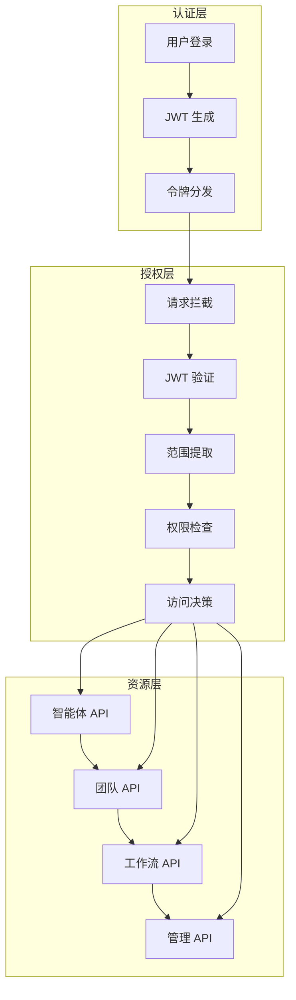

<Badge icon="code-branch" color="orange">
    <Tooltip tip="Introduced in v2.3.13" cta="View release notes" href="https://github.com/agno-agi/agno/releases/tag/v2.3.13">v2.3.13</Tooltip>
</Badge>

AgentOS 提供内置的基于角色的访问控制 (RBAC)，验证 JWT 范围是否符合 API 每个端点所需的权限。这使您能够控制谁可以访问和运行您的智能体、团队和工作流，以及 AgentOS API 上的其他功能。

此功能使您能够在 AgentOS 上构建自己的应用程序时控制访问权限。

可视化 AgentOS RBAC 中的身份和授权流程：


- **控制平面**（或您的认证系统）生成签名的 JWT 令牌，对用户身份和权限进行编码。
- JWT 令牌在来自您的应用程序后端、UI 或集成的每次 API 调用时都会被呈现。
- **AgentOS** 在授予对智能体、团队、工作流和其他内部资源的访问权限之前，验证每个 JWT 并检查所需范围。

## 快速开始

在初始化 AgentOS 时启用 RBAC：

```python 
from agno.agent import Agent
from agno.db.postgres import PostgresDb
from agno.models.openai import OpenAIChat
from agno.os import AgentOS
from agno.os.config import AuthorizationConfig

db = PostgresDb(db_url="postgresql+psycopg://ai:ai@localhost:5532/ai")

agent = Agent(
    id="my-agent",
    name="我的智能体",
    model=OpenAIChat(id="gpt-4"),
    instructions="你是一个有用的助手。",
    db=db
)

# 配置 RBAC
auth_config = AuthorizationConfig(
    enabled=True,
    jwt_secret_key="your-jwt-secret-key",
    jwt_algorithm="HS256",
    default_scopes=["read"]  # 默认权限范围
)

agent_os = AgentOS(
    id="my-agent-os",
    agents=[agent],
    authorization=auth_config
)

if __name__ == "__main__":
    agent_os.serve(app="agent_os:app", reload=True)
```

## RBAC 架构

### 核心组件



### 权限范围定义

AgentOS RBAC 使用以下权限范围：

| 范围 | 描述 | 示例用法 |
|------|------|----------|
| `read` | 读取资源信息 | 获取智能体列表、查看配置 |
| `write` | 修改资源 | 更新智能体配置、创建新资源 |
| `execute` | 执行智能体/团队/工作流 | 运行智能体、启动工作流 |
| `admin` | 管理权限 | 删除资源、系统配置 |
| `monitor` | 监控权限 | 查看日志、性能指标 |
| `integrations` | 集成权限 | 管理外部集成 |

## 配置详解

### 1. 基本配置

```python
from agno.os.config import AuthorizationConfig

# 基本 RBAC 配置
auth_config = AuthorizationConfig(
    enabled=True,
    jwt_secret_key="your-jwt-secret-key",
    jwt_algorithm="HS256",
    jwt_expire_minutes=60,  # 令牌过期时间（分钟）
    default_scopes=["read"],  # 默认权限范围
    exclude_paths=["/health", "/metrics"]  # 排除的路径
)
```

### 2. 高级配置

```python
from agno.os.config import AuthorizationConfig

# 高级 RBAC 配置
auth_config = AuthorizationConfig(
    enabled=True,
    jwt_secret_key="your-jwt-secret-key",
    jwt_algorithm="RS256",  # 使用非对称加密
    jwt_public_key="your-public-key",  # 公钥（RS256 时需要）
    jwt_private_key="your-private-key",  # 私钥（RS256 时需要）
    jwt_expire_minutes=60,
    jwt_issuer="your-app",  # 令牌发行者
    jwt_audience="your-users",  # 令牌受众
    default_scopes=["read"],
    exclude_paths=["/health", "/metrics", "/docs"],
    scope_separator=" ",  # 范围分隔符
    auto_error=True,  # 自动返回错误
    require_authentication=True,  # 要求认证
    role_claim="roles",  # 角色声明字段
    scope_claim="scopes",  # 范围声明字段
    user_id_claim="sub",  # 用户 ID 声明字段
)
```

### 3. 环境变量配置

```bash
# RBAC 环境变量配置
export OS_JWT_SECRET_KEY="your-jwt-secret-key"
export OS_JWT_ALGORITHM="HS256"
export OS_JWT_EXPIRE_MINUTES="60"
export OS_JWT_ISSUER="your-app"
export OS_JWT_AUDIENCE="your-users"
export OS_DEFAULT_SCOPES="read"
export OS_EXCLUDE_PATHS="/health,/metrics"
export OS_SCOPE_SEPARATOR=" "
export OS_REQUIRE_AUTHENTICATION="true"
```

## JWT 令牌生成

### 1. 使用控制平面生成

```python
import jwt
import time
from datetime import datetime, timedelta

def generate_jwt_token(user_id: str, roles: list, scopes: list, secret_key: str):
    """生成 JWT 令牌"""
    now = datetime.utcnow()
    payload = {
        "sub": user_id,  # 用户 ID
        "roles": roles,  # 用户角色
        "scopes": scopes,  # 权限范围
        "iat": now,  # 签发时间
        "exp": now + timedelta(hours=1),  # 过期时间
        "iss": "your-app",  # 发行者
        "aud": "your-users",  # 受众
        "jti": str(uuid.uuid4())  # JWT ID
    }
    
    token = jwt.encode(
        payload,
        secret_key,
        algorithm="HS256"
    )
    
    return token

# 示例：为管理员生成令牌
admin_token = generate_jwt_token(
    user_id="admin-123",
    roles=["admin"],
    scopes=["read", "write", "execute", "admin"],
    secret_key="your-jwt-secret-key"
)

print(f"管理员令牌: {admin_token}")
```

### 2. 使用外部认证服务

```python
import httpx
from typing import Optional

class ExternalAuthService:
    def __init__(self, auth_server_url: str):
        self.auth_server_url = auth_server_url
    
    async def authenticate_user(self, username: str, password: str) -> Optional[str]:
        """使用外部服务认证用户"""
        async with httpx.AsyncClient() as client:
            response = await client.post(
                f"{self.auth_server_url}/auth/login",
                json={"username": username, "password": password}
            )
            
            if response.status_code == 200:
                auth_data = response.json()
                return auth_data.get("access_token")
            
            return None
    
    async def validate_token(self, token: str) -> Optional[dict]:
        """验证令牌"""
        async with httpx.AsyncClient() as client:
            response = await client.post(
                f"{self.auth_server_url}/auth/validate",
                headers={"Authorization": f"Bearer {token}"}
            )
            
            if response.status_code == 200:
                return response.json()
            
            return None

# 使用外部认证服务
auth_service = ExternalAuthService("https://auth.yourapp.com")
```

## 权限控制

### 1. 智能体权限

```python
from agno.agent import Agent
from agno.os.decorators import require_scopes

# 定义需要特定权限的智能体
class SecureAgent(Agent):
    @require_scopes(["execute", "read"])
    async def run(self, message: str, user_id: str = None):
        """需要 execute 和 read 权限才能运行"""
        return await super().run(message, user_id)
    
    @require_scopes(["admin"])
    async def update_config(self, config: dict):
        """需要 admin 权限才能更新配置"""
        self.config.update(config)
        return {"status": "success", "config": self.config}

# 创建安全智能体
secure_agent = SecureAgent(
    id="secure-agent",
    name="安全智能体",
    instructions="你是一个需要权限验证的智能体",
)

# 在 AgentOS 中注册
agent_os = AgentOS(
    id="secure-os",
    agents=[secure_agent],
    authorization=auth_config
)
```

### 2. 团队权限

```python
from agno.team import Team
from agno.os.decorators import require_scopes

class SecureTeam(Team):
    @require_scopes(["execute", "read"])
    async def run(self, message: str, user_id: str = None):
        """团队执行需要权限"""
        return await super().run(message, user_id)
    
    @require_scopes(["write"])
    async def add_member(self, agent_id: str, role: str):
        """添加团队成员需要 write 权限"""
        self.add_agent(agent_id, role)
        return {"status": "success", "team_size": len(self.agents)}
    
    @require_scopes(["admin"])
    async def remove_member(self, agent_id: str):
        """移除团队成员需要 admin 权限"""
        self.remove_agent(agent_id)
        return {"status": "success"}

# 创建安全团队
secure_team = SecureTeam(
    name="安全团队",
    instructions="这是一个需要权限验证的团队"
)

# 添加成员（需要相应权限）
secure_team.add_agent("agent-1", "analyst")
secure_team.add_agent("agent-2", "reviewer")
```

### 3. 工作流权限

```python
from agno.workflow import Workflow
from agno.os.decorators import require_scopes

class SecureWorkflow(Workflow):
    @require_scopes(["execute", "read"])
    async def run(self, input_data: str, user_id: str = None):
        """工作流执行需要权限"""
        return await super().run(input_data, user_id)
    
    @require_scopes(["write"])
    async def update_step(self, step_id: str, config: dict):
        """更新工作流步骤需要 write 权限"""
        self.update_step_config(step_id, config)
        return {"status": "success"}
    
    @require_scopes(["admin"])
    async def delete_workflow(self):
        """删除工作流需要 admin 权限"""
        # 删除逻辑
        return {"status": "success"}

# 创建安全工作流
secure_workflow = SecureWorkflow(
    name="安全工作流",
    description="需要权限验证的工作流"
)
```

## 权限检查

### 1. 手动权限检查

```python
from agno.os.security import PermissionChecker

class CustomAPI:
    def __init__(self, permission_checker: PermissionChecker):
        self.permission_checker = permission_checker
    
    async def get_agent_list(self, request):
        """获取智能体列表"""
        # 检查权限
        if not await self.permission_checker.has_scopes(request, ["read"]):
            return {"error": "权限不足"}, 403
        
        # 执行业务逻辑
        agents = await self.get_all_agents()
        return {"agents": agents}, 200
    
    async def create_agent(self, request, agent_config):
        """创建智能体"""
        # 检查权限
        if not await self.permission_checker.has_scopes(request, ["write"]):
            return {"error": "权限不足"}, 403
        
        # 执行业务逻辑
        agent = await self.create_new_agent(agent_config)
        return {"agent": agent}, 201

# 使用权限检查器
permission_checker = PermissionChecker(auth_config)
custom_api = CustomAPI(permission_checker)
```

### 2. 装饰器权限检查

```python
from agno.os.decorators import require_scopes, require_roles
from functools import wraps

def api_endpoint(scopes: list = None, roles: list = None):
    """API 端点装饰器"""
    def decorator(func):
        @wraps(func)
        async def wrapper(request, *args, **kwargs):
            # 检查权限范围
            if scopes and not await check_scopes(request, scopes):
                return {"error": "权限范围不足"}, 403
            
            # 检查角色
            if roles and not await check_roles(request, roles):
                return {"error": "角色权限不足"}, 403
            
            # 执行函数
            return await func(request, *args, **kwargs)
        
        return wrapper
    return decorator

# 使用装饰器
@api_endpoint(scopes=["read"])
async def get_agents(request):
    """获取智能体列表"""
    agents = await fetch_agents()
    return {"agents": agents}

@api_endpoint(scopes=["write"], roles=["admin", "manager"])
async def update_agent(request, agent_id: str, config: dict):
    """更新智能体配置"""
    agent = await update_agent_config(agent_id, config)
    return {"agent": agent}
```

## 角色管理

### 1. 角色定义

```python
from enum import Enum
from typing import Dict, List

class UserRole(Enum):
    """用户角色枚举"""
    GUEST = "guest"
    USER = "user"
    DEVELOPER = "developer"
    ADMIN = "admin"
    SUPER_ADMIN = "super_admin"

class RoleManager:
    def __init__(self):
        self.role_permissions = {
            UserRole.GUEST: ["read"],
            UserRole.USER: ["read", "execute"],
            UserRole.DEVELOPER: ["read", "execute", "write"],
            UserRole.ADMIN: ["read", "execute", "write", "admin"],
            UserRole.SUPER_ADMIN: ["read", "execute", "write", "admin", "monitor", "integrations"]
        }
        
        self.role_hierarchy = {
            UserRole.GUEST: 0,
            UserRole.USER: 1,
            UserRole.DEVELOPER: 2,
            UserRole.ADMIN: 3,
            UserRole.SUPER_ADMIN: 4
        }
    
    def get_permissions(self, role: UserRole) -> List[str]:
        """获取角色权限"""
        return self.role_permissions.get(role, [])
    
    def has_permission(self, user_role: UserRole, required_permission: str) -> bool:
        """检查角色是否有特定权限"""
        permissions = self.get_permissions(user_role)
        return required_permission in permissions
    
    def can_access_role(self, user_role: UserRole, target_role: UserRole) -> bool:
        """检查用户是否可以访问目标角色资源"""
        user_level = self.role_hierarchy.get(user_role, 0)
        target_level = self.role_hierarchy.get(target_role, 0)
        return user_level >= target_level

# 使用角色管理器
role_manager = RoleManager()

# 检查权限
user_role = UserRole.DEVELOPER
has_write_permission = role_manager.has_permission(user_role, "write")
can_access_admin = role_manager.can_access_role(user_role, UserRole.ADMIN)
```

### 2. 动态角色分配

```python
class DynamicRoleManager:
    def __init__(self):
        self.user_roles = {}  # user_id -> [roles]
        self.role_assignments = {}  # role -> [permissions]
    
    def assign_role(self, user_id: str, role: str, permissions: list = None):
        """为用户分配角色"""
        if user_id not in self.user_roles:
            self.user_roles[user_id] = []
        
        if role not in self.user_roles[user_id]:
            self.user_roles[user_id].append(role)
        
        if permissions:
            self.role_assignments[role] = permissions
    
    def remove_role(self, user_id: str, role: str):
        """移除用户角色"""
        if user_id in self.user_roles:
            if role in self.user_roles[user_id]:
                self.user_roles[user_id].remove(role)
    
    def get_user_permissions(self, user_id: str) -> List[str]:
        """获取用户所有权限"""
        user_roles = self.user_roles.get(user_id, [])
        permissions = []
        
        for role in user_roles:
            role_permissions = self.role_assignments.get(role, [])
            permissions.extend(role_permissions)
        
        return list(set(permissions))  # 去重
    
    def has_permission(self, user_id: str, permission: str) -> bool:
        """检查用户是否有特定权限"""
        user_permissions = self.get_user_permissions(user_id)
        return permission in user_permissions

# 使用动态角色管理器
dynamic_role_manager = DynamicRoleManager()

# 分配角色
dynamic_role_manager.assign_role("user-123", "developer", ["read", "execute", "write"])
dynamic_role_manager.assign_role("user-123", "analyst", ["read", "execute"])

# 检查权限
has_write_permission = dynamic_role_manager.has_permission("user-123", "write")
```

## 监控和审计

### 1. 访问日志

```python
import logging
import time
from datetime import datetime
from typing import Dict, Any

class SecurityAuditor:
    def __init__(self):
        self.logger = logging.getLogger("security_audit")
        self.access_logs = []
        
        # 配置日志
        handler = logging.FileHandler("security_audit.log")
        formatter = logging.Formatter(
            '%(asctime)s - %(name)s - %(levelname)s - %(message)s'
        )
        handler.setFormatter(formatter)
        self.logger.addHandler(handler)
    
    def log_access_attempt(self, request, user_info: Dict[str, Any], success: bool):
        """记录访问尝试"""
        log_entry = {
            "timestamp": datetime.utcnow().isoformat(),
            "user_id": user_info.get("user_id"),
            "roles": user_info.get("roles", []),
            "scopes": user_info.get("scopes", []),
            "method": request.method,
            "path": request.url.path,
            "client_ip": request.client.host if request.client else "unknown",
            "user_agent": request.headers.get("User-Agent"),
            "success": success,
            "execution_time": user_info.get("execution_time", 0)
        }
        
        # 记录到内存
        self.access_logs.append(log_entry)
        
        # 记录到日志文件
        log_level = logging.INFO if success else logging.WARNING
        self.logger.log(log_level, f"访问尝试: {log_entry}")
    
    def get_access_statistics(self) -> Dict[str, Any]:
        """获取访问统计"""
        total_attempts = len(self.access_logs)
        successful_attempts = sum(1 for log in self.access_logs if log["success"])
        
        # 按用户统计
        user_stats = {}
        for log in self.access_logs:
            user_id = log["user_id"]
            if user_id not in user_stats:
                user_stats[user_id] = {"total": 0, "success": 0}
            
            user_stats[user_id]["total"] += 1
            if log["success"]:
                user_stats[user_id]["success"] += 1
        
        # 按端点统计
        endpoint_stats = {}
        for log in self.access_logs:
            endpoint = log["path"]
            if endpoint not in endpoint_stats:
                endpoint_stats[endpoint] = {"total": 0, "success": 0}
            
            endpoint_stats[endpoint]["total"] += 1
            if log["success"]:
                endpoint_stats[endpoint]["success"] += 1
        
        return {
            "total_attempts": total_attempts,
            "successful_attempts": successful_attempts,
            "success_rate": successful_attempts / total_attempts if total_attempts > 0 else 0,
            "user_statistics": user_stats,
            "endpoint_statistics": endpoint_stats
        }

# 使用安全审计器
security_auditor = SecurityAuditor()
```

### 2. 异常检测

```python
from collections import defaultdict
import time

class SecurityMonitor:
    def __init__(self):
        self.failed_attempts = defaultdict(list)
        self.suspicious_activities = []
        self.alert_thresholds = {
            "failed_attempts_per_minute": 5,
            "failed_attempts_per_hour": 20,
            "unusual_access_patterns": 10
        }
    
    def record_failed_attempt(self, user_id: str, client_ip: str, endpoint: str):
        """记录失败尝试"""
        timestamp = time.time()
        
        self.failed_attempts[user_id].append({
            "timestamp": timestamp,
            "client_ip": client_ip,
            "endpoint": endpoint
        })
        
        # 检查是否需要发出警报
        self.check_failed_attempts(user_id)
    
    def check_failed_attempts(self, user_id: str):
        """检查失败尝试是否超过阈值"""
        current_time = time.time()
        user_attempts = self.failed_attempts[user_id]
        
        # 检查最近一分钟的失败尝试
        recent_attempts = [
            attempt for attempt in user_attempts
            if current_time - attempt["timestamp"] < 60
        ]
        
        if len(recent_attempts) >= self.alert_thresholds["failed_attempts_per_minute"]:
            self.alert_suspicious_activity(
                "high_failed_attempts",
                user_id=user_id,
                count=len(recent_attempts),
                time_window="1分钟"
            )
        
        # 检查最近一小时的失败尝试
        hour_attempts = [
            attempt for attempt in user_attempts
            if current_time - attempt["timestamp"] < 3600
        ]
        
        if len(hour_attempts) >= self.alert_thresholds["failed_attempts_per_hour"]:
            self.alert_suspicious_activity(
                "high_failed_attempts",
                user_id=user_id,
                count=len(hour_attempts),
                time_window="1小时"
            )
    
    def alert_suspicious_activity(self, activity_type: str, **kwargs):
        """警报可疑活动"""
        alert = {
            "timestamp": time.time(),
            "type": activity_type,
            "details": kwargs
        }
        
        self.suspicious_activities.append(alert)
        
        # 发送警报通知
        self.send_security_alert(alert)
    
    def send_security_alert(self, alert: Dict[str, Any]):
        """发送安全警报"""
        print(f"安全警报: {alert}")
        # 这里可以集成邮件、短信或其他通知系统

# 使用安全监控器
security_monitor = SecurityMonitor()
```

## 最佳实践

### 1. 权限设计原则

- **最小权限原则**: 只授予用户完成任务所需的最小权限
- **职责分离**: 将不同职责分配给不同角色
- **权限继承**: 高级角色自动包含低级角色权限
- **定期审查**: 定期审查和更新用户权限

### 2. 令牌管理

- **短期有效**: 使用短期有效的令牌
- **刷新机制**: 实施令牌刷新机制
- **撤销支持**: 支持令牌撤销功能
- **安全存储**: 安全存储和管理密钥

### 3. 安全配置

- **环境隔离**: 为不同环境使用不同的安全配置
- **密钥轮换**: 定期轮换密钥
- **监控告警**: 设置安全监控和告警
- **备份恢复**: 制定安全配置的备份和恢复策略

## 故障排除

### 常见问题

#### JWT 验证失败

**问题**: JWT 令牌验证失败
**解决方案**:
1. 检查密钥配置是否正确
2. 验证令牌格式和内容
3. 确认算法配置匹配
4. 检查令牌是否过期

#### 权限检查失败

**问题**: 权限检查返回拒绝
**解决方案**:
1. 验证用户角色和权限配置
2. 检查范围声明是否正确
3. 确认端点权限要求
4. 检查权限映射逻辑

#### 性能问题

**问题**: RBAC 检查影响性能
**解决方案**:
1. 缓存权限检查结果
2. 优化权限验证逻辑
3. 使用异步权限检查
4. 实施权限预计算

## 下一步

- 查看[JWT 中间件](/agent-os/middleware/jwt)
- 了解[AgentOS 配置](/agent-os/config)
- 探索[AgentOS API](/agent-os/api)
- 查看[安全概述](/agent-os/security/overview)