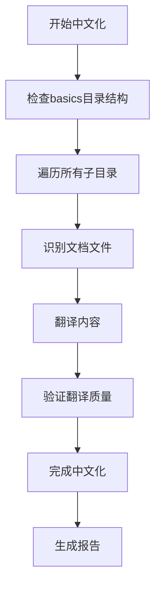

# 中文化计划 - Basics 目录

## 项目结构分析
当前目录包含 basics 目录，其中包含以下子目录和文件：
- agents/ - 代理相关
- agent-ui/ - 代理用户界面
- chat-history/ - 聊天历史
- context/ - 上下文
- context-compression/ - 上下文压缩
- culture/ - 文化
- database/ - 数据库
- dependencies/ - 依赖
- evals/ - 评估
- guardrails/ - 安全护栏
- hitl/ - 人机交互
- hooks/ - 钩子
- input-output/ - 输入输出
- knowledge/ - 知识
- memory/ - 记忆
- models/ - 模型
- multimodal/ - 多模态
- reasoning/ - 推理
- sessions/ - 会话
- state/ - 状态
- teams/ - 团队
- tools/ - 工具
- tracing/ - 追踪
- vectordb/ - 向量数据库
- workflows/ - 工作流
- custom-logging.mdx - 自定义日志
- telemetry.mdx - 遥测

## 中文化任务列表

1. 检查并中文化所有子目录中的内容
2. 确保所有 .md, .mdx, .txt 等文档文件被中文化
3. 特别注意以下需要翻译的内容：
   - 文件标题 (title)
   - 描述信息 (description)
   - 文档内容中的英文段落
   - 注释和说明文字
4. 保留技术术语、代码块和路径链接
5. 检查目录名是否需要中文化
6. 生成中文化后的目录结构

## 预计流程图

